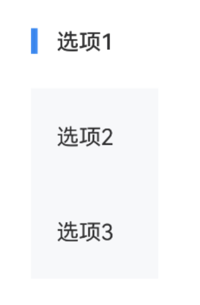
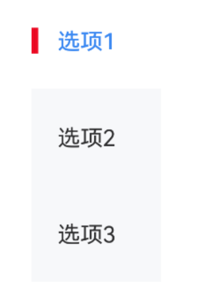
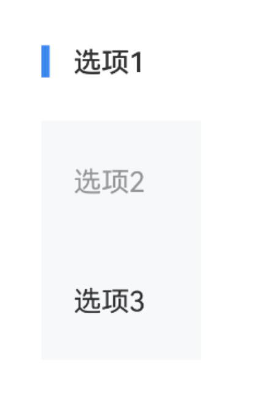
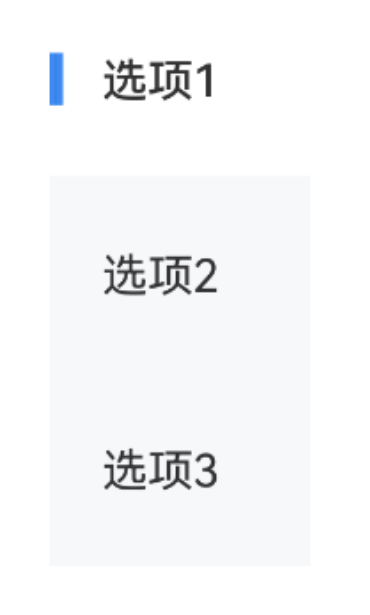

# SideBar 侧边导航

## 介绍

垂直展示的导航栏，用于在不同的内容区域之间进行切换。
 
## 引入

```ts
import { IBestSideBar, IBestSideBarItem } from "@ibestservices/ibest-ui-v2";
```

## 代码演示

### 基础用法



::: details 点我查看代码
```ts
@Entry
@ComponentV2
struct DemoPage {
  @Local groupId: string = "group"
  @Local active: number = 0
  @Local itemList: Array<string> = ["选项1", "选项2", "选项3"]
  build() {
    Column(){
      IBestSideBar({
        groupId: this.groupId,
        active: this.active!!
      }){
        ForEach(this.itemList, (item: string, index) => {
          IBestSideBarItem({
            groupId: this.groupId,
            index: index,
            title: item
          })
        })
      }
    }
  }
}
```
:::

### 自定义样式



::: details 点我查看代码
```ts
@Entry
@ComponentV2
struct DemoPage {
  @Local groupId: string = "group"
  @Local active: number = 0
  @Local itemList: Array<string> = ["选项1", "选项2", "选项3"]
  build() {
    Column(){
      IBestSideBar({
        groupId: this.groupId,
        active: this.active!!,
        leftBarColor: "#ee0a24",
        activeFontColor: "#3d8af2"
      }){
        ForEach(this.itemList, (item: string, index) => {
          IBestSideBarItem({
            groupId: this.groupId,
            index: index,
            title: item
          })
        })
      }
    }
  }
}
```
:::

### 禁用选项



::: details 点我查看代码
```ts
@Entry
@ComponentV2
struct DemoPage {
  @Local groupId: string = "group"
  @Local active: number = 0
  @Local itemList: Array<string> = ["选项1", "选项2", "选项3"]
  build() {
    Column(){
      IBestSideBar({
        groupId: this.groupId,
        active: this.active!!
      }){
        ForEach(this.itemList, (item: string, index) => {
          IBestSideBarItem({
            groupId: this.groupId,
            index: index,
            title: item,
            disabled: index == 1
          })
        })
      }
    }
  }
}
```
:::

### 切换事件



::: details 点我查看代码
```ts
@Entry
@ComponentV2
struct DemoPage {
  @Local groupId: string = "group"
  @Local active: number = 0
  @Local itemList: Array<string> = ["选项1", "选项2", "选项3"]
  build() {
    Column(){
      IBestSideBar({
        groupId: this.groupId,
        active: this.active!!,
        onChange: (index: number) => {
          console.log(this.itemList[index])
        }
      }){
        ForEach(this.itemList, (item: string, index) => {
          IBestSideBarItem({
            groupId: this.groupId,
            index: index,
            title: item
          })
        })
      }
    }
  }
}
```
:::

## API

### IBestSideBar @Props

| 参数          | 说明                        | 类型      | 默认值     |
| ------------ | --------------------------- | ---------| ---------- |
| groupId      | 分组id                       | _string_ \| _number_  | `''`  |
| active       | 当前导航项的索引               | _number_  | `0`  |
| sideWidth    | 宽度                         | _string_ \| _number_ | `80`  |
| maxHeight    | 最大高度                      | _string_ \| _number_ | `''`  |
| titleColor   | 文字颜色                      | _ResourceColor_ | `#323233`  |
| titleFontSize| 文字大小                      | _string_ \| _number_ | `14`  |
| bgColor      | 背景色                        | _ResourceColor_ | `#f7f8fa`  |
| activeBgColor| 激活项背景色                   | _ResourceColor_ | `#fff`  |
| showLeftBar  | 是否显示左侧颜色条              | _boolean_ | `true`  |
| leftBarSize  | 左侧颜色条尺寸                 | _LeftBarSize_ | `{width: 4, height: 16}`  |
| leftBarColor | 左侧颜色条颜色                 | _ResourceColor_ | `#3d8af2` |
| activeFontColor | 激活项文字颜色              | _ResourceColor_ | `#323232` |
| activeFontWeight| 激活项文字字重              | _FontWeight_ | `Medium` |

### LeftBarSize 数据类型
| 属性名     | 说明                     | 类型      | 默认值     |
| ----------| ------------------------| --------- | ---------|
| width     | 宽度                     | _string_ \| _number_  | `4`  |
| height    | 高度                     | _string_ \| _number_   | `16`  |

### IBestSideBar 插槽
| 插槽名             | 说明                             | 类型             |
| ------------------| --------------------------------| ----------------|
| defaultBuilder    | 默认内容                         | _CustomBuilder_ |

### IBestSideBar Events

| 事件名     | 说明                  | 回调参数                         |
| ----------| ---------------------| -------------------------------- |
| onChange  | 切换事件回调           | `index: number` |


### IBestSideBarItem @Props
| 参数         | 说明                                          | 类型      | 默认值     |
| ------------ | ---------------------------------------------| --------- | ---------|
| groupId      | 分组id, 与IBestSideBar `groupId` 一致          | _string_ \| _number_  | `''`  |
| index        | 索引                                          | _number_  | `0`  |
| title        | 选项文字                                       | _ResourceStr_ | `''` |
| disabled     | 是否禁用                                       | _boolean_ | `false` |

### IBestSideBarItem 插槽
| 插槽名             | 说明                             | 类型             |
| ------------------| --------------------------------| ----------------|
| defaultBuilder    | 默认内容                         | _CustomBuilder_ |

### IBestSideBarItem Events

| 事件名        | 说明                  | 回调参数                         |
| -------------| ---------------------| -------------------------------- |
| onItemClick  | 选项点击回调           | `index: number` |

## 主题定制

组件提供了下列颜色变量，可用于自定义深色/浅色模式样式，使用方法请参考 [颜色模式](../../guide/color-mode/index.md) 章节，如需要其它颜色变量可提 [issue](https://github.com/ibestservices/ibest-ui/issues)。

| 名称                                       | 描述                              | 默认值        |
| -------------------------------------------|----------------------------------|--------------|
| ibest_sidebar_background                   | 背景色                            | `#f7f8fa`   |