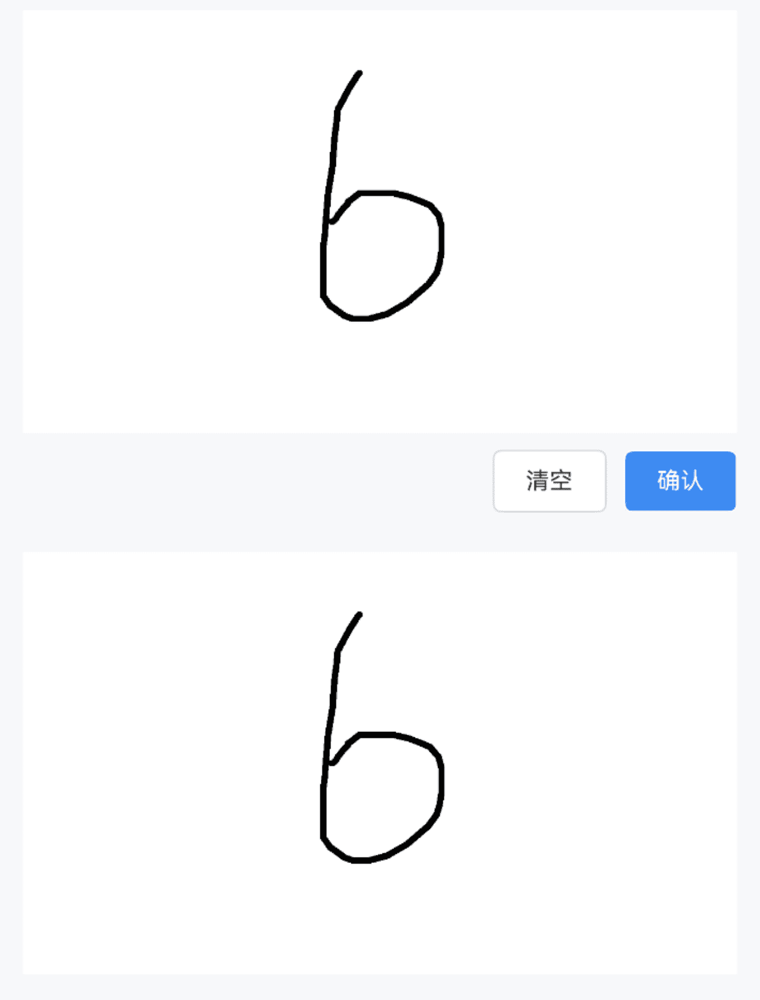
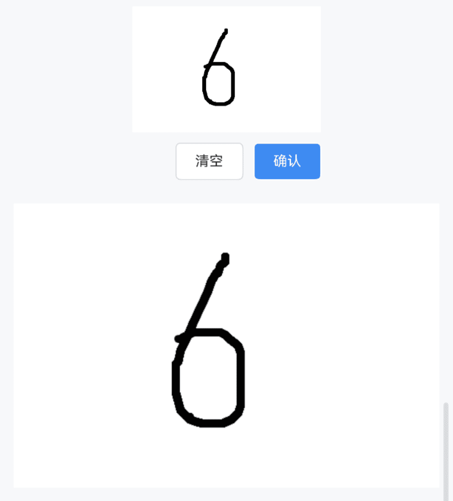

# Signature 签名

## 介绍

用于签名场景的组件，基于 Canvas 实现。
 
## 引入

```ts
import { IBestSignature } from "@ibestservices/ibest-ui-v2";
```

## 代码演示

### 基础用法



::: details 点我查看代码
```ts
@Entry
@Component
struct DemoPage {
  @State imgUrl: string = ""
  build() {
    Column({ space: 20 }){
      IBestSignature({
        onConfirm: (url: string) => {
          this.imgUrl = url
        }
      })
      if(this.imgUrl){
        Image(this.imgUrl)
      }
    }
  }
}
```
:::

### 自定义样式


::: details 点我查看代码
```ts
@Entry
@Component
struct DemoPage {
  @State imgUrl: string = ""
  build() {
    Column({ space: 20 }){
      IBestSignature({
        penColor: "#ff0000",
        lineWidth: 5,
        bgColor: "#eee",
        onConfirm: (url: string) => {
          this.imgUrl = url
        }
      })
      if(this.imgUrl){
        Image(this.imgUrl)
      }
    }
  }
}
```
:::

### 自定义宽高



::: details 点我查看代码
```ts
@Entry
@Component
struct DemoPage {
  @State imgUrl: string = ""
  build() {
    Column({ space: 20 }){
      IBestSignature({
        boardWidth: 300,
        boardHeight: 200,
        onConfirm: (url: string) => {
          this.imgUrl = url
        }
      })
      if(this.imgUrl){
        Image(this.imgUrl)
      }
    }
  }
}
```
:::

### controller 控制器


::: details 点我查看代码
```ts
import { IBestSignatureController } from "@ibestservices/ibest-ui-v2";
@Entry
@Component
struct DemoPage {
  @State imgUrl: string = ""
  private controller: IBestSignatureController = new IBestSignatureController()
  build() {
    Column({ space: 20 }){
      IBestSignature({
        controller: this.controller,
        isShowFooter: false,
        onConfirm: (url: string) => {
          this.imgUrl = url
        }
      })
      if(this.imgUrl){
        Image(this.imgUrl)
      }
      Row({ space: 10 }){
        IBestButton({
          text: '清空',
          onClickBtn: () => {
            this.controller.clear()
          }
        })
        IBestButton({
          text: '确认',
          type: 'primary',
          onClickBtn: () => {
            this.controller.confirm()
          }
        })
      }
    }
  }
}
```
:::

## API

### @Props

| 参数         | 说明                                          | 类型      | 默认值     |
| ------------ | ---------------------------------------------| --------- | ---------- |
| boardWidth   | 画板宽度, 小于0都默认为百分百                    | _number \| string_  | `100%` |
| boardHeight  | 画板高度                                      | _number \| string_ |  `200`  |
| exportImgType| 导出图片类型, 可选值 `png` `jpeg` `webp`        | _string_ | `png` |
| penColor     | 笔触颜色                                      | _string \| number \| <a href="https://developer.huawei.com/consumer/cn/doc/harmonyos-references-V5/ts-components-canvas-canvasgradient-V5" target="__blank">CanvasGradient</a> \| <a href="https://developer.huawei.com/consumer/cn/doc/harmonyos-references-V5/ts-components-canvas-canvaspattern-V5#canvaspattern" target="__blank">CanvasPattern</a>_ | `#000` |
| lineWidth    | 线条宽度                                       | _number_ | `3` |
| bgColor      | 背景色                                         | _string \| number \| <a href="https://developer.huawei.com/consumer/cn/doc/harmonyos-references-V5/ts-components-canvas-canvasgradient-V5" target="__blank">CanvasGradient</a> \| <a href="https://developer.huawei.com/consumer/cn/doc/harmonyos-references-V5/ts-components-canvas-canvaspattern-V5#canvaspattern" target="__blank">CanvasPattern</a>_ | `#fff` |
| clearText    | 清除按钮文案                                    | _ResourceStr_ | `清空` |
| confirmText  | 确认按钮文案                                    | _ResourceStr_ | `确认` |
| isShowFooter | 是否显示底部按钮                                 | _boolean_ | `true` |
| predictionAssist| 是否开启报点预测                             | _boolean_ | `false` |
| controller   | 实例控制器                                      | _IBestSignatureController_ | `-` |

### Events

| 事件名     | 说明             | 回调参数  |
| ----------| --------------  | -------- |
| onDrawEnd | 手指离开屏幕触发   | `-` |
| onConfirm | 点击确定按钮的回调 | `url: string` |
| onClear   | 点击清空按钮的回调 | `-` |

### IBestSignatureController 控制器
| 方法名     | 说明                            | 参数类型  |
| ----------| ------------------------------ | -------- |
| clear     | 清空画板, 会触发onClear事件       | `-` |
| confirm   | 确认签名, 会触发onConfirm事件     | `-` |