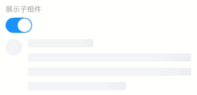
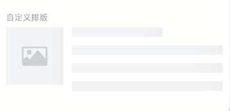

# Skeleton 骨架屏

## 介绍

用于在内容加载过程中展示一组占位图形。
 
## 引入

```ts
import { IBestSkeleton, IBestSkeletonParagraph } from "@ibestservices/ibest-ui-v2";
```

## 代码演示

### 基础用法


::: details 点我查看代码
```ts
@Entry
@ComponentV2
struct DemoPage {
  build() {
    Column(){
      IBestSkeleton()
    }
  }
}
```
:::

### 显示头像


::: details 点我查看代码
```ts
@Entry
@ComponentV2
struct DemoPage {
  build() {
    Column(){
      IBestSkeleton({
        avatar: true
      })
    }
  }
}
```
:::

### 自定义段落行数


:::tip
显示的数量会比传入的数量多 1，首行会被渲染一个长度 40% 的段首。
:::

::: details 点我查看代码
```ts
@Entry
@ComponentV2
struct DemoPage {
  build() {
    Column(){
      IBestSkeleton({
        rows: 4,
        radius: 4
      })
    }
  }
}
```
:::

### 展示子组件



::: details 点我查看代码
```ts
import { IBestSwitch } from "@ibestservices/ibest-ui-v2";
@Entry
@ComponentV2
struct DemoPage {
  @State loading: boolean = true
  build() {
    Column({ space: 12}){
      IBestSwitch({
        value: this.loading!!
      })
      IBestSkeleton({
        avatar: true,
        loading: this.loading
      }){
        Row({space: 12}){
          Image($r("app.media.app_icon")).width(32).aspectRatio(1)
          Column({space: 12}){
            Text("关于IBest-UI")
            Text("一个轻量、简单易用、可定制主题、支持深色模式和浅色模式的鸿蒙开源UI组件库。)
          }
          .layoutWeight(1)
          .alignItems(HorizontalAlign.Start)
        }.alignItems(VerticalAlign.Top)
      }
    }
    .alignItems(HorizontalAlign.Start)
  }
}
```
:::

### 自定义排版



::: details 点我查看代码
```ts
@Entry
@ComponentV2
struct DemoPage {
  build() {
    Row({space: 14}){
      IBestSkeletonParagraph({type: "image"})
      Column({space: 14}){
        IBestSkeletonParagraph({type: "text", rowWidth: "60%"})
        IBestSkeletonParagraph()
        IBestSkeletonParagraph()
        IBestSkeletonParagraph()
      }
      .layoutWeight(1)
      .alignItems(HorizontalAlign.Start)
    }
    .alignItems(VerticalAlign.Top)
  }
}
```
:::


## API

### IBestSkeleton @Props

| 参数          | 说明                                 | 类型      | 默认值     |
| ------------ | ----------------------------------- | --------- | ---------- |
| rows         | 段落占位图行数                         | _number_  | `3` |
| avatar       | 是否显示头像占位图                      | _boolean_ |  `false`  |
| animated     | 是否使用动画                           | _boolean_ |  `true`  |
| radius       | 圆角, circle类型无效                   | _string_ \| _number_ |  `0`  |
| loading      | 加载                                  | _boolean_ |  `true`  |

### IBestSkeleton 插槽

| 插槽名              | 说明                | 类型             |
| ------------------ | -------------------| ----------------|
| defaultBuilder     | 要显示的自定义内容    | _CustomBuilder_ |

### IBestSkeletonParagraph @Props

| 参数          | 说明                                 | 类型      | 默认值     |
| ------------ | ----------------------------------- | --------- | ---------- |
| type         | 占位图类型, 可选值 `text`、`avatar`、`circle`、`image`   | _string_  | `text` |
| rowWidth     | 占位图宽度, type为 `text` 时默认 `100%`, type为 `image` 时默认 `96`, 其他类型默认 `32`| _string_ \| _number_ |  `-`  |
| rowHeight    | 占位图高度, 仅type为text时有效           | _string_ \| _number_ |  `16`  |
| radius       | 圆角, circle类型无效                   | _string_ \| _number_ |  `0`  |
| animated     | 是否使用动画                           | _boolean_ |  `true`  |