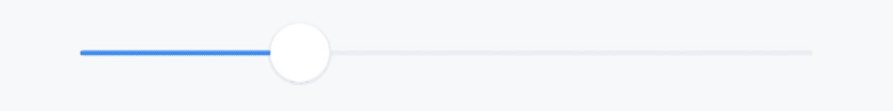
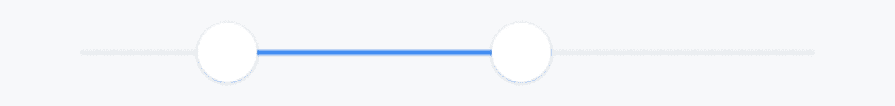
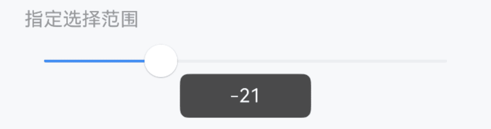
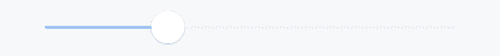
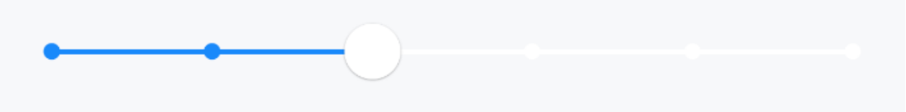
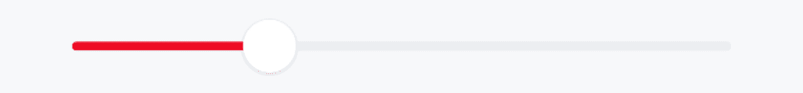
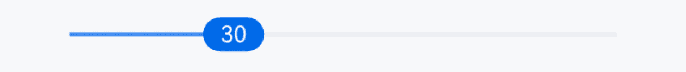
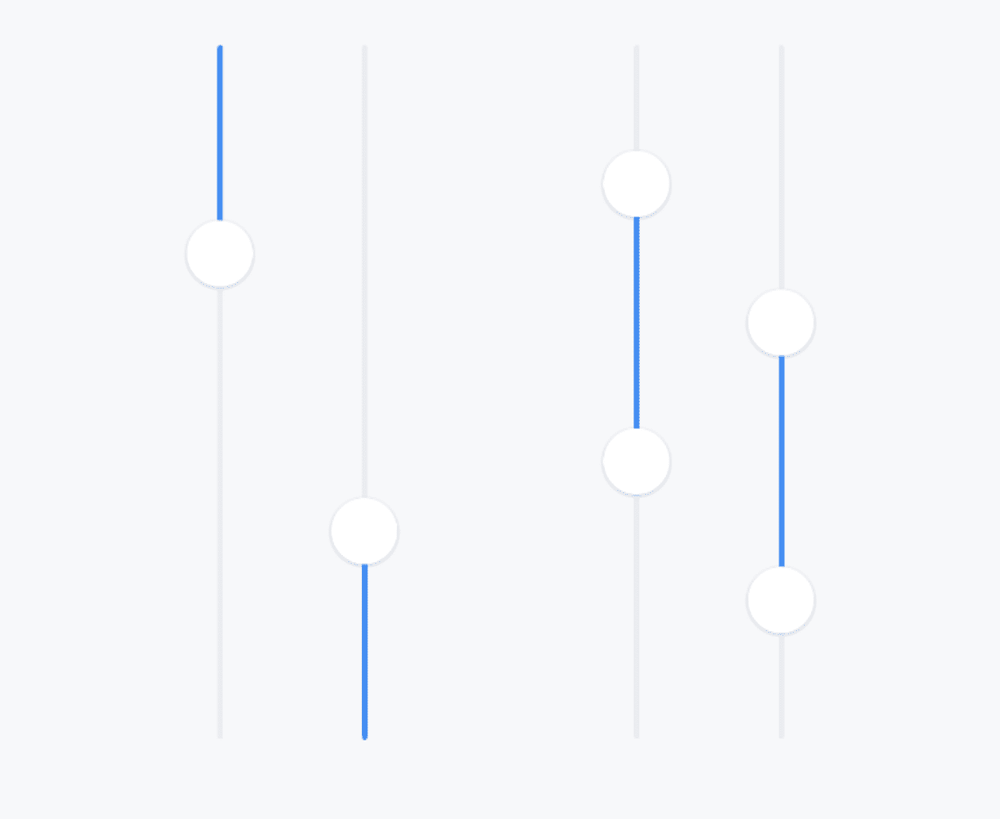

# Slider 滑块

## 介绍

滑动输入条，用于在给定的范围内选择一个值。
 
## 引入

```ts
import { IBestSlider } from "@ibestservices/ibest-ui-v2";
```

## 代码演示

### 基础用法



::: details 点我查看代码
```ts
@Entry
@ComponentV2
struct DemoPage {
  @Local value: number = 30
  build() {
    Column(){
      IBestSlider({
        value: this.value!!,
        onChange: (val) => {
          console.log(val.toString())
        }
      })
    }
    .padding({ left: 20, right: 20 })
  }
}
```
:::

### 双滑块



::: details 点我查看代码
```ts
@Entry
@ComponentV2
struct DemoPage {
  @Local value: [number, number] = [20, 60]
  build() {
    Column(){
      IBestSlider({
        value: this.value!!,
        onChange: (val) => {
          console.log(val.toString())
        }
      })
    }
    .padding({ left: 20, right: 20 })
  }
}
```
:::

### 指定选择范围



::: details 点我查看代码
```ts
@Entry
@ComponentV2
struct DemoPage {
  @Local value: number = 30
  build() {
    Column(){
      IBestSlider({
        value: this.value!!,
        min: -50,
        max: 50,
        onChange: (val) => {
          console.log(val.toString())
        }
      })
    }
    .padding({ left: 20, right: 20 })
  }
}
```
:::

### 禁用



::: details 点我查看代码
```ts
@Entry
@ComponentV2
struct DemoPage {
  @Local value: number = 30
  build() {
    Column(){
      IBestSlider({
        value: this.value!!,
        disabled: true
      })
    }
    .padding({ left: 20, right: 20 })
  }
}
```
:::

### 指定步长



::: details 点我查看代码
```ts
@Entry
@ComponentV2
struct DemoPage {
  @Local value: number = 30
  build() {
    Column(){
      IBestSlider({
        value: this.value!!,
        step: 10,
        ticks: true,
        onChange: (val) => {
          console.log(val.toString())
        }
      })
    }
    .padding({ left: 20, right: 20 })
  }
}
```
:::

### 自定义样式



::: details 点我查看代码
```ts
@Entry
@ComponentV2
struct DemoPage {
  @Local value: number = 30
  build() {
    Column(){
      IBestSlider({
        value: this.value!!,
        barHeight: 8,
        activeColor: "#ee0a24",
        onChange: (val) => {
          console.log(val.toString())
        }
      })
    }
    .padding({ left: 20, right: 20 })
  }
}
```
:::

### 自定义按钮



::: details 点我查看代码
```ts
@Entry
@ComponentV2
struct DemoPage {
  @Local value: number = 30
  @Builder customBtn(){
    Text(this.value.toString())
      .height(18)
      .borderRadius(9999)
      .padding({ left: 5, right: 5 })
      .backgroundColor("#006AE9")
      .fontColor("#FFFFFF")
      .fontSize(12)
  }
  build() {
    Column(){
      IBestSlider({
        value: this.value!!,
        customButton: (): void => this.customBtn(),
        onChange: (val) => {
          console.log(val.toString())
        }
      })
    }
    .padding({ left: 20, right: 20 })
  }
}
```
:::

### 垂直方向


:::tip
通过 `reverse` 属性可以设置换向。
:::
 
::: details 点我查看代码
```ts
@Entry
@ComponentV2
struct DemoPage {
  @Local value: number = 30
  @Local value1: [number, number] = [20, 60]
  build() {
    Row({ space: 80 }){
      Row({ space: 30 }){
        IBestSlider({
          value: this.value!!,
          vertical: true,
          onChange: (val) => {
            console.log(val.toString())
          }
        })
        IBestSlider({
          value: this.value!!,
          vertical: true,
          reverse: true,
          onChange: (val) => {
            console.log(val.toString())
          }
        })
      }
      Row({ space: 30 }){
        IBestSlider({
          value: this.value1!!,
          vertical: true,
          onChange: (val) => {
            console.log(val.toString())
          }
        })
        IBestSlider({
          value: this.value1!!,
          vertical: true,
          reverse: true,
          onChange: (val) => {
            console.log(val.toString())
          }
        })
      }
    }
    .width(CONTAINER_SIZE.FULL)
    .height(300)
    .justifyContent(FlexAlign.Center)
  }
}
```
:::

## API

### @Props

| 参数         | 说明                                   | 类型      | 默认值     |
| ------------ | -------------------------------------| --------- | ---------- |
| value        | 滑动条当前值，支持双向绑定               | _number \| [number, number]_ | `-` |
| max          | 最大值                                | _number_  | `100` |
| min          | 最小值                                | _number_ |  `0`  |
| step         | 步长                                  | _number_ | `1` |
| barHeight    | 进度条高度                             | _string_ \| _number_ | `2` |
| buttonSize   | 滑块大小, 宽高一致                      | _string_ \| _number_ | `24` |
| activeColor  | 进度条激活态颜色                        | _ResourceColor_ | `#3D8AF2` |
| barBgColor   | 进度条背景色                           | _ResourceColor_ | `#ebedf0` |
| disabled     | 是否禁用                              | _boolean_ | `false` |
| vertical     | 是否垂直展示                           | _boolean_ |  `false`  |
| reverse      | 是否换向                              | _boolean_ |  `false`  |
| buttonBgColor| 滑块背景颜色                           | _ResourceColor_ |  `#fff`  |
| ticks <span style="font-size: 12px; padding:2px 4px;color:#3D8AF2;border-radius:4px;border: 1px solid #3D8AF2">1.0.4</span>| 是否显示刻度点   | _boolean_ | `false` |

### 插槽

| 插槽名             | 说明                 | 类型             |
| -------------------| --------------------| ----------------|
| customButton       | 自定义滑块           | _CustomBuilder_ |
| customSecondButton | 自定义第二个滑块      | _CustomBuilder_ |

### Events

| 事件名     | 说明                    | 事件类型             |
| ----------| ------------------------| --------------------- |
| onChange  | 进度变化时触发           | `(value: IBestSliderValue) => void` |

## 主题定制

组件提供了下列颜色变量，可用于自定义深色/浅色模式样式，使用方法请参考 [颜色模式](../../guide/color-mode/index.md) 章节，如需要其它颜色变量可提 [issue](https://github.com/ibestservices/ibest-ui/issues)。

| 名称                                       | 描述                              | 默认值        |
| -------------------------------------------|----------------------------------|--------------|
| ibest_slider_inactive_background           | 进度条背景颜色                     | `#ebedf0`   |