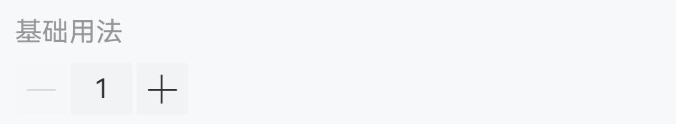
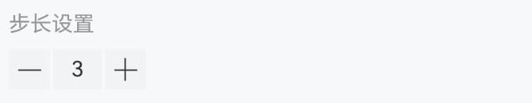
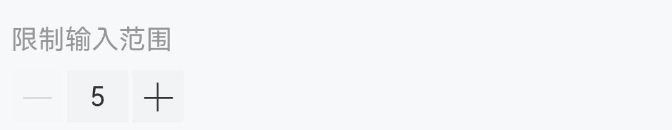
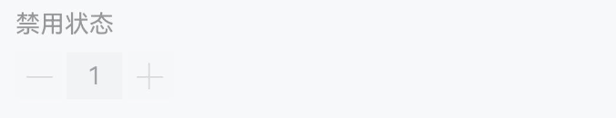
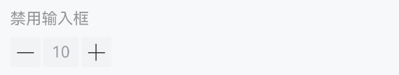
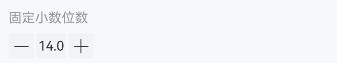
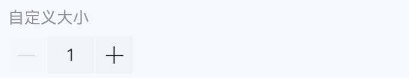

# Stepper 步进器

## 介绍

步进器由增加按钮、减少按钮和输入框组成，用于在一定范围内输入、调整数字。

## 引入

```ts
import { IBestStepper } from "@ibestservices/ibest-ui-v2";
```

## 代码演示

### 基础用法



::: details 点我查看代码
```ts
@Entry
@ComponentV2
struct DemoPage {
  @Local value: number = 1
  build() {
    Column(){
      IBestStepper({
        value: this.value!!
      })
    }
  }
}
```
:::

### 步长设置


::: tip
通过 `step` 属性设置每次点击增加或减少按钮时变化的值，默认为 `1`。
:::

::: details 点我查看代码
```ts
@Entry
@ComponentV2
struct DemoPage {
  @Local value: number = 1
  build() {
    Column(){
      IBestStepper({
        value: this.value!!,
        step: 2
      })
    }
  }
}
```
:::

### 限制输入范围


::: tip
通过 `min` 和 `max` 属性限制输入值的范围，默认超出范围后会自动校正最大值或最小值，通过 `autoFixed` 可以关闭自动校正。
:::

::: details 点我查看代码
```ts
@Entry
@ComponentV2
struct DemoPage {
  @Local value: number = 1
  build() {
    Column(){
      IBestStepper({
        value: this.value!!,
        min: 5,
        max: 8
      })
    }
  }
}
```
:::

### 限制输入整数


::: tip
设置 `integer` 属性后，输入框将限制只能输入整数。
:::

::: details 点我查看代码
```ts
@Entry
@ComponentV2
struct DemoPage {
  @Local value: number = 1
  build() {
    Column(){
      IBestStepper({
        value: this.value!!,
        integer: true
      })
    }
  }
}
```
:::

### 禁用状态


::: tip
通过设置 `disabled` 属性来禁用步进器，禁用状态下无法点击按钮或修改输入框。
:::

::: details 点我查看代码
```ts
@Entry
@ComponentV2
struct DemoPage {
  @Local value: number = 1
  build() {
    Column(){
      IBestStepper({
        value: this.value!!,
        disabled: true
      })
    }
  }
}
```
:::

### 禁用输入框


::: tip
通过设置 `disableInput` 属性来禁用输入框，此时按钮仍然可以点击。
:::

::: details 点我查看代码
```ts
@Entry
@ComponentV2
struct DemoPage {
  @Local value: number = 1
  build() {
    Column(){
      IBestStepper({
        value: this.value!!,
        disableInput: true
      })
    }
  }
}
```
:::

### 固定小数位数


::: tip
通过设置 `decimalLength` 属性可以保留固定的小数位数。
:::

::: details 点我查看代码
```ts
@Entry
@ComponentV2
struct DemoPage {
  @Local value: number = 1
  build() {
    Column(){
      IBestStepper({
        value: this.value!!,
        step: 0.2,
        decimalLength: 1
      })
    }
  }
}
```
:::

### 自定义大小


::: tip
通过 `inputWidth` 属性设置输入框宽度，通过 `buttonSize` 属性设置按钮大小和输入框高度。
:::

::: details 点我查看代码
```ts
@Entry
@ComponentV2
struct DemoPage {
  @Local value: number = 1
  build() {
    Column(){
      IBestStepper({
        value: this.value!!,
        inputWidth: 40,
        buttonSize: 32
      })
    }
  }
}
```
:::

## API

### @Props

| 参数          | 说明                                        | 类型          | 默认值     |
| ------------- | -------------------------------------------| ------------- | ---------- |
| value         | 绑定值, 支持双向绑定                          | _number_ | `-` |
| min           | 最小值                                      | _string_ \| _number_ | `1` |
| max           | 最大值                                      | _string_ \| _number_ | `Infinity` |
| autoFixed     | 是否自动校正超出限制范围的数值                  | _boolean_            | `true`     |
| step          | 步长，每次点击时改变的值                       | _string_ \| _number_ | `1`        |
| inputWidth    | 输入框宽度                                   | _string_ \| _number_ | `32`    |
| buttonSize    | 按钮大小以及输入框高度                         | _string_ \| _number_ | `27`    |
| decimalLength | 固定显示的小数位数                             | _string_ \| _number_ |  `0` |
| integer       | 是否只允许输入整数                             | _boolean_    | `false`    |
| disabled      | 是否禁用步进器                                | _boolean_     | `false`    |
| disablePlus   | 是否禁用增加按                                | _boolean_     | `false`    |
| disableMinus  | 是否禁用减少按钮                               | _boolean_    | `false`    |
| disableInput  | 是否禁用输入框                                 | _boolean_    | `false`    |
| showPlus      | 是否显示增加按钮                               | _boolean_    | `true`     |
| showMinus     | 是否显示减少按钮                               | _boolean_    | `true`     |
| showInput     | 是否显示输入框                                 | _boolean_    | `true`     |
| longPress     | 是否开启长按手势，开启后可以长按增加和减少按钮       | _boolean_   | `true`     |
| validateTime  | 多少毫秒触发自动校验修正，为 `0` 时不修正，单位 `ms`| _number_    | `1000`     |
| iconSize      | 输入框中图标的宽度                              | _string_ \| _number_ | `20` |
| buttonRadius  | 按钮的圆角                                     | _string_ \| _number_ | `2`  |

### Events

| 事件名   | 说明                | 事件类型                            |
| -------- | -------------------| ----------------------------------- |
| onChange | 当值变化时触发的事件 | `(val: number) => void`             |
| onPlus   | 点击增加按钮时触发   | `() => void`                        |
| onMinus  | 点击较少按钮时触发   | `() => void`                        |

## 主题定制

组件提供了下列颜色变量，可用于自定义深色/浅色模式样式，使用方法请参考 [颜色模式](../../guide/color-mode/index.md) 章节，如需要其它颜色变量可提 [issue](https://github.com/ibestservices/ibest-ui/issues)。

| 名称                                       | 描述                              | 默认值        |
| -------------------------------------------|----------------------------------|--------------|
| ibest_stepper_background                   | 背景颜色                          | `#f2f3f5`   |
| ibest_stepper_disabled_background          | 禁用时背景颜色                     | `#f7f8fa`   |
| ibest_stepper_disabled_text_color          | 禁用时文字颜色                     | `#c8c9cc`   |