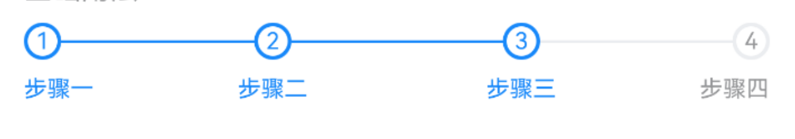
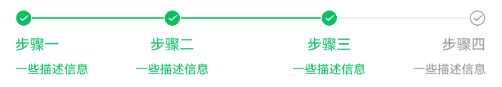

# Steps 步骤条

## 介绍

用于展示操作流程的各个环节，让用户了解当前的操作在整体流程中的位置。
 
## 引入

```ts
import { IBestSteps } from "@ibestservices/ibest-ui-v2";
```

## 代码演示

### 基础用法



::: details 点我查看代码
```ts
@Entry
@ComponentV2
struct DemoPage {
  @Local active: number = 0
  @Local groupId: string = 'steps'
  build() {
    Column(){
      IBestSteps({
        groupId: this.groupId,
        active: this.active
      }){
        IBestStep({groupId: this.groupId, title: "步骤一"})
        IBestStep({groupId: this.groupId, title: "步骤二"})
        IBestStep({groupId: this.groupId, title: "步骤三"})
      }
    }
  }
}
```
:::

### 标记类型


::: details 点我查看代码
```ts
@Entry
@ComponentV2
struct DemoPage {
  @Local active: number = 0
  @Local groupId: string = 'steps'
  build() {
    Column(){
      IBestSteps({
        groupId: this.groupId,
        active: this.active,
        type: 'dot'
      }){
        IBestStep({groupId: this.groupId, title: "步骤一"})
        IBestStep({groupId: this.groupId, title: "步骤二"})
        IBestStep({groupId: this.groupId, title: "步骤三"})
      }
    }
  }
}
```
:::

### 自定义样式



::: details 点我查看代码
```ts
@Entry
@ComponentV2
struct DemoPage {
  @Local active: number = 0
  @Local groupId: string = 'steps'
  build() {
    Column(){
      IBestSteps({
        groupId: this.groupId,
        active: this.active,
        type: 'icon',
        inactiveIcon: "passed",
        activeIcon: "checked",
        activeColor: "#07c160"
      }){
        IBestStep({groupId: this.groupId, title: "步骤一", description: "一些描述信息"})
        IBestStep({groupId: this.groupId, title: "步骤二", description: "一些描述信息"})
        IBestStep({groupId: this.groupId, title: "步骤三", description: "一些描述信息"})
      }
    }
  }
}
```
:::

### 竖向步骤条


::: details 点我查看代码
```ts
@Entry
@ComponentV2
struct DemoPage {
  @Local active: number = 0
  @Local groupId: string = 'steps'
  @Builder customStepContent(index: number){
    Column({space: 10}){
      Text("【城市】物流状态" + (index + 1))
        .fontColor(this.active >= index ? "#1989fa" : "#323233")
      Text("2025-05-01")
        .fontColor(this.active >= index ? "#1989fa" : "#323233")
    }
    .alignItems(HorizontalAlign.Start)
  }
  build() {
    Column(){
      IBestSteps({
        groupId: this.groupId,
        dotSize: 8,
        active: this.active,
        placeDirection: Axis.Vertical
      }){
        ForEach([0, 1, 2], (_: number, index: number) => {
          IBestStep({
            groupId: this.groupId,
            type: index == 1 ? "dot" : "icon",
            inactiveIcon: index == 0 ? "like-o" : "passed",
            activeIcon: index == 0 ? "like" : "checked",
          }){
            this.customStepContent(index)
          }
        })
      }
    }
  }
}
```
:::

## API

### IBestSteps @Props

| 参数         | 说明                                      | 类型      | 默认值     |
| ------------ | -----------------------------------------| --------- | ---------- |
| groupId      | 分组id，通常为一个唯一的字符串，需具备`全局唯一性`或已入栈的页面`唯一性`| _string_ \| _number_ | `''`|
| active       | 当前激活的步骤索引                          | _number_ | `0` |
| placeDirection| 步骤条方向                                | _Axis_ | `Horizontal` |
| type         | 步骤条标记类型, 可选值 `num`、`dot`、`icon`  | _string_ |  `num`  |
| dotSize      | 点大小                                    | _string_ \| _number_ |  `6`  |
| inactiveIcon | 未激活底部图标, 仅type为 icon 时有效         | _ResourceStr_ |  `''`  |
| activeIcon   | 激活底部图标, 仅type为 icon 时有效           | _ResourceStr_ |  `''`  |
| iconSize     | 图标大小, 仅type为 icon 时有效              | _string_ \| _number_ |  `14`  |
| inactiveColor| 未激活颜色                                 | _ResourceColor_ |  `#969799`  |
| activeColor  | 激活颜色                                   | _ResourceColor_ |  `#1989fa`  |
| bgColor      | 背景颜色                                   | _ResourceColor_ |  `#fff`  |

### IBestSteps 插槽

| 插槽名             | 说明               | 类型             |
| ------------------| ------------------| ----------------|
| defaultBuilder    | 默认内容的插槽      | _CustomBuilder_ |

### IBestStep @Props

| 参数         | 说明                                      | 类型      | 默认值     |
| ------------ | -----------------------------------------| --------- | ---------- |
| groupId      | 分组id，与IBestSteps的groupId 一致         | _string_ \| _number_ | `''`|
| title        | 标题                                      | _ResourceStr_ | `''` |
| description  | 描述                                      | _ResourceStr_ | `''` |
| type         | 步骤条标记类型, 可选值 `num`、`dot`、`icon`  | _string_ |  `num`  |
| dotSize      | 点大小                                     | _string_ \| _number_ |  `6`  |
| inactiveIcon | 未激活底部图标, 仅type为 icon 时有效         | _ResourceStr_ |  `''`  |
| activeIcon   | 激活底部图标, 仅type为 icon 时有效           | _ResourceStr_ |  `''`  |
| iconSize     | 图标大小, 仅type为 icon 时有效              | _string_ \| _number_ |  `14`  |
| inactiveColor| 未激活颜色                                 | _ResourceColor_ |  `#969799`  |
| activeColor  | 激活颜色                                   | _ResourceColor_ |  `#1989fa`  |

### IBestStep 插槽

| 插槽名             | 说明               | 类型             |
| ------------------| ------------------| ----------------|
| defaultBuilder    | 默认内容的插槽      | _CustomBuilder_ |

## 主题定制

组件提供了下列颜色变量，可用于自定义深色/浅色模式样式，使用方法请参考 [颜色模式](../../guide/color-mode/index.md) 章节，如需要其它颜色变量可提 [issue](https://github.com/ibestservices/ibest-ui/issues)。

| 名称                                       | 描述                              | 默认值        |
| -------------------------------------------|----------------------------------|--------------|
| ibest_step_background_color                | 背景色                            | `#fff`   |
| ibest_step_text_color                      | 文字颜色                           | `#969799`   |
| ibest_step_active_color                    | 激活态文字颜色                     | `#1989fa`   |