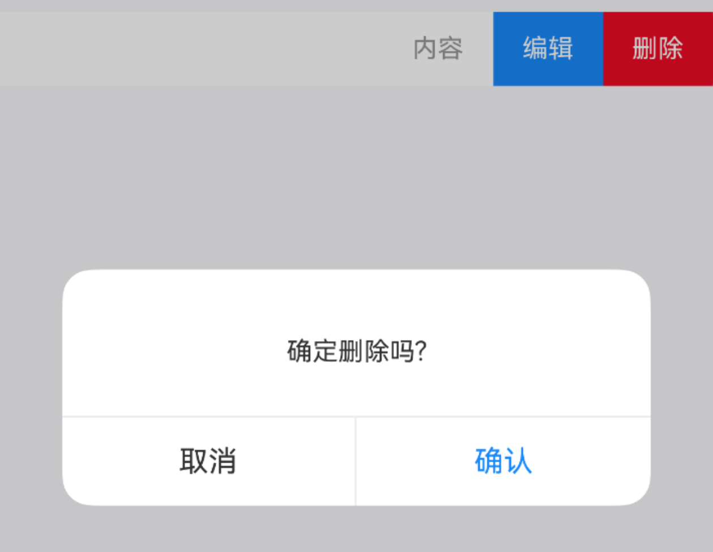

# SwipeCell 滑动单元格

## 介绍

可以左右滑动来展示操作按钮的单元格组件。
 
## 引入

```ts
import { IBestSwipeCell } from "@ibestservices/ibest-ui-v2";
```

## 代码演示

### 基础用法


::: details 点我查看代码
```ts
@Entry
@Component
struct DemoPage {
  @Builder cellContent(){
    IBestCell({
      title: '单元格',
      value: '内容',
      hasBorder: false
    })
  }
  @Builder leftContent(){
    IBestButton({
      type: 'primary',
      text: '选择',
      square: true
    })
  }
  @Builder rightContent(){
    IBestButton({
      type: 'primary',
      text: '编辑',
      square: true
    })
    IBestButton({
      type: 'danger',
      text: '删除',
      square: true
    })
  }
  build() {
    Column(){
      IBestSwipeCell({
        defaultContent: this.cellContent,
        leftContent: this.leftContent,
        rightContent: this.rightContent
      })
    }
  }
}
```
:::

### 异步关闭



::: details 点我查看代码
```ts
@Entry
@Component
struct DemoPage {
  @Builder cellContent(){
    IBestCell({
      title: '单元格',
      value: '内容',
      hasBorder: false
    })
  }
  @Builder rightContent(){
    IBestButton({
      type: 'danger',
      text: '删除',
      square: true
    })
  }
  build() {
    Column(){
      IBestSwipeCell({
        defaultContent: this.cellContent,
        rightContent: this.rightContent,
        beforeClose: (position) => {
          if(position == 'center'){
            return true
          }
          return new Promise((resolve) => {
            IBestDialogUtil.open({
              message: '确定删除吗?',
              showCancelButton: true,
              onConfirm: () => {
                resolve(true)
              },
              onCancel: () => {
                resolve(false)
              }
            })
          })
        }
      })
    }
  }
}
```
:::


## API

### @Props

| 参数                   | 说明              | 类型      | 默认值  |
| --------------------- | ------------------| ----------| ------ |
| beforeClose           | 关闭前回调          | _(position: SwipeCellSide) => boolean \| Promise\<boolean\>_ | `-` |

### Events

| 事件名       | 说明            | 回调参数                         |
| ------------| ---------------| -------------------------------- |
| onContentClick| 内容点击时触发 | `-` |

### 插槽

| 插槽名             | 说明               | 类型             |
| ------------------| ------------------| ----------------|
| leftContent       | 左侧内容的插槽      | _CustomBuilder_ |
| rightContent      | 右侧内容的插槽      | _CustomBuilder_ |
| defaultContent    | 中间内容的插槽      | _CustomBuilder_ |