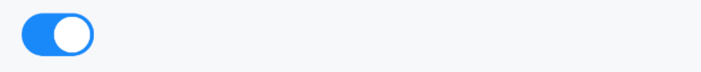

# Switch 开关

## 介绍

用于在打开和关闭状态之间进行切换。

## 引入

```ts
import { IBestSwitch } from "@ibestservices/ibest-ui-v2";
```

## 代码演示

### 基础用法


::: tip
通过 `IBestSwitch` 组件的 `value` 来设置开关的状态，通过 `onChange` 监听状态变化。
:::

::: details 点我查看代码
```ts
@Entry
@ComponentV2
struct DemoPage {
  @Local value: boolean = false
  build() {
    Column(){
      IBestSwitch({
        value: this.value!!
      })
    }
  }
}
```
:::

### 禁用状态


::: tip
通过 `disabled` 属性来禁用开关，禁用状态下开关不可点击。
:::

::: details 点我查看代码
```ts
@Entry
@ComponentV2
struct DemoPage {
  @Local value1: boolean = true
	@Local value2: boolean = false
  build() {
    Column({space: 14}){
      IBestSwitch({
        value: this.value1!!,
        disabled: true
      })
      IBestSwitch({
        value: this.value2!!,
        disabled: true
      })
    }
  }
}
```
:::

### 加载状态


::: tip
通过 `loading` 属性来禁用开关，加载状态下开关不可点击。
:::

::: details 点我查看代码
```ts
@Entry
@ComponentV2
struct DemoPage {
  @Local value1: boolean = true
	@Local value2: boolean = false
  build() {
    Column({space: 14}){
      IBestSwitch({
        value: this.value1!!,
        loading: true
      })
      IBestSwitch({
        value: this.value2!!,
        loading: true,
        activeColor: '#07c160'
      })
    }
  }
}
```
:::

### 自定义大小


::: tip
通过 `switchSize` 属性自定义开关的大小。
:::

::: details 点我查看代码
```ts
@Entry
@ComponentV2
struct DemoPage {
  @Local value: boolean = true
  build() {
    Column(){
      IBestSwitch({
        value: this.value!!,
        switchSize: 20
      })
    }
  }
}
```
:::

### 自定义按钮


::: tip
通过 `nodeBuilder` 插槽自定义按钮的内容。
:::

::: details 点我查看代码
```ts
@Entry
@ComponentV2
struct DemoPage {
  @Local value: boolean = true
  @Local arrowDirection: 'left' | 'right' = 'left'
  @Builder Arrow(){
    Row(){
      Image($r('app.media.arrow'))
        .width(15)
        .fillColor(this.arrowDirection === 'left' ? '#db3131' : '#e2e3e7')
        .rotate({
          angle: this.arrowDirection === 'left' ? 0 : -180
        }).animation({
          duration: 200
        })
    }
  }
  build(){
    Column(){
      IBestSwitch({
        value: this.value!!,
        activeColor: '#db3131',
        nodeBuilder: () => this.Arrow(),
        onChange: value => {
          this.arrowDirection = value ? 'left' : 'right'
        }
      })
    }
  }
}
```
:::

### 异步控制


::: tip
当需要异步控制开关状态时，可以在 `onBeforeChange` 事件的回调函数中返回一个 `Promise` 。如果 `Promise` 状态为 `resolve` ，则按钮状态变化将继续进行；如果状态为 `reject` ，则将阻止按钮状态的变化。
:::

::: details 点我查看代码
```ts
@Entry
@ComponentV2
struct DemoPage {
  @Local value: boolean = true
  build() {
    Column(){
      IBestSwitch({
        value: this.value!!,
        onBeforeChange: () => {
          return new Promise((resolve, reject) => {
            IBestDialogUtil.open({
              title: "提示",
              message: "确定更改状态?",
              showCancelButton: true,
              onConfirm: () => {
                resolve()
              },
              onCancel: () => {
                reject()
              }
            })
          })
        }
      })
    }
  }
}
```
:::

## API

### @Props

| 参数     | 说明       | 类型      | 默认值        |
| ------- | ---------- | --------- | ----------- |
| value           | 默认是否选中, 支持双向绑定 | _boolean_ | `false` |
| disabled        | 是否禁用按钮             | _boolean_ | `false`  |
| loading         | 是否显示为加载状态        | _boolean_ | `false` |
| switchSize      | 大小尺寸                | _string_ \| _number_  | `26` |
| activeColor     | 打开时的背景色           | _ResourceColor_  | `#1989fa` |
| inactiveColor   | 关闭时的背景色           | _ResourceColor_  | `rgba(120, 120, 128, 0.2)` |
| loadingActiveColor | 打开时的 loading 颜色，默认跟随 `activeColor`    | _ResourceColor_  |        |
| loadingInactiveColor | 关闭时的 loading 颜色，默认跟随 `activeColor`  | _ResourceColor_  |        |

### Events

| 事件名          | 说明                          | 事件类型                   |
| -------------- | ------------------------------| -------------------------------------- |
| onChange       | 开关状态改变的回调事件          | `(value: boolean) => void`   |
| onBeforeChange | 开关状态改变前的回调事件，value 为将要改变的状态, 接收一个 `Promise` 对象，如果 `Promise` 状态为 `resolve` ，则按钮状态变化将继续进行；如果状态为 `reject` ，则将阻止按钮状态的变化。 | `(value: boolean) => Promise<boolean> \| boolean` |
| onSwitchClick  | 点击开关的回调事                | `() => void`  |

### 插槽

| 插槽名      | 说明             | 类型                      |
| ----------- | ---------------| ------------------------- |
| nodeBuilder | 自定义按钮的内容 | _CustomBuilder_ |

## 主题定制

组件提供了下列颜色变量，可用于自定义深色/浅色模式样式，使用方法请参考 [颜色模式](../../guide/color-mode/index.md) 章节，如需要其它颜色变量可提 [issue](https://github.com/ibestservices/ibest-ui/issues)。

| 名称                                       | 描述                              | 默认值        |
| -------------------------------------------|----------------------------------|--------------|
| ibest_switch_background                    | 背景颜色                          | `#e2e3e7`   |