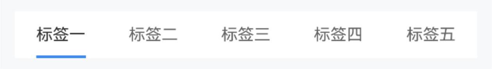
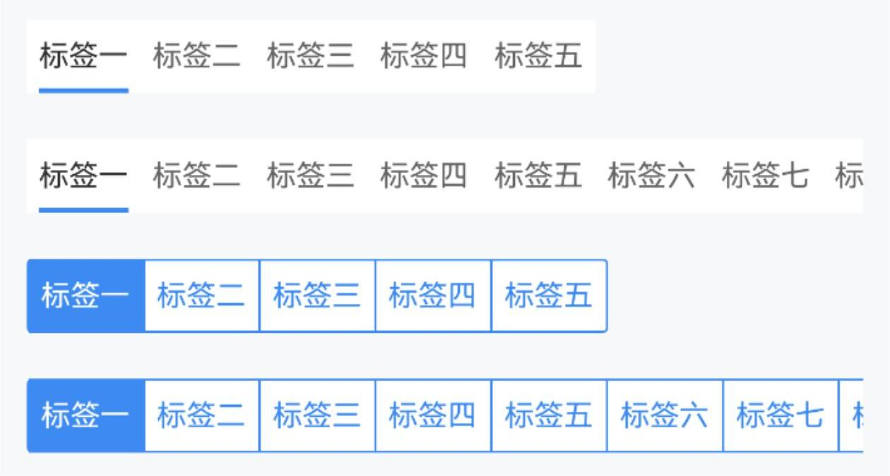
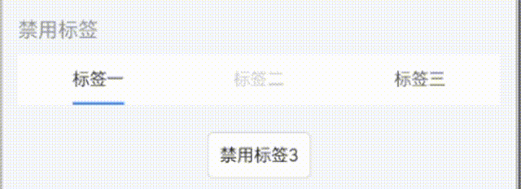
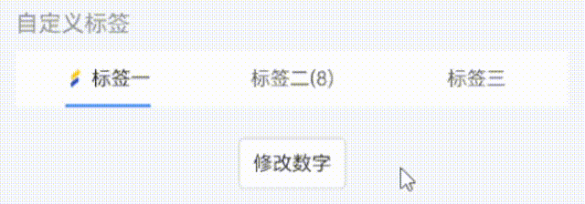
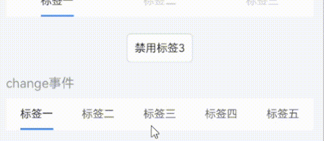
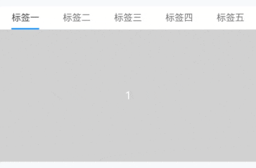

# Tab 标签页

## 介绍

选项卡组件，用于在不同的内容区域之间进行切换。

## 引入

```ts
import {IBestTabs, IBestTabItem, IBestTabItemType} from "@ibestservices/ibest-ui-v2"
```

## 代码演示

### 基本用法



::: details 点我查看代码

```ts
@Entry
@ComponentV2
struct DemoPage {
  @Local tabsList: IBestTabItemType[] = [
    {
      label: "标签一",
      name: "1"
    },
    {
      label: "标签二",
      name: "2"
    },
    {
      label: "标签三",
      name: "3"
    },
    {
      label: "标签四",
      name: "4"
    },
    {
      label: "标签五",
      name: "5"
    }
  ]
  @Local curTabName: string = "1"
  build() {
    Column(){
      IBestTabs({
        tabsList: this.tabsList,
        currentName: this.curTabName!!
      })
    }
  }
}
```
:::

### 样式风格


::: details 点我查看代码

```ts
@Entry
@ComponentV2
struct DemoPage {
  @Local tabsList: IBestTabItemType[] = [
    {
      label: "标签一",
      name: "1"
    },
    {
      label: "标签二",
      name: "2"
    },
    {
      label: "标签三",
      name: "3"
    },
    {
      label: "标签四",
      name: "4"
    },
    {
      label: "标签五",
      name: "5"
    }
  ]
  @Local curTabName: string = "1"
  build() {
    Column(){
      IBestTabs({
        tabsList: this.tabsList,
        type: "card",
        currentName: this.curTabName!!
      })
    }
  }
}
```
:::

### 收缩布局


::: tip
通过 `tabWidthType` 属性可设置单个tab的宽度类型。
:::

::: details 点我查看代码

```ts
@Entry
@ComponentV2
struct DemoPage {
  @Local tabsList: IBestTabItemType[] = [
    {
      label: "标签一",
      name: "1"
    },
    {
      label: "标签二",
      name: "2"
    },
    {
      label: "标签三",
      name: "3"
    },
    {
      label: "标签四",
      name: "4"
    },
    {
      label: "标签五",
      name: "5"
    }
  ]
  @Local tabsList1: IBestTabItem[] = [
    new IBestTabItem({
      label: "标签一",
      name: "1"
    }),
    new IBestTabItem({
      label: "标签二",
      name: "2"
    }),
    new IBestTabItem({
      label: "标签三",
      name: "3"
    }),
    new IBestTabItem({
      label: "标签四",
      name: "4"
    }),
    new IBestTabItem({
      label: "标签五",
      name: "5"
    }),
    new IBestTabItem({
      label: "标签六",
      name: "6"
    }),
    new IBestTabItem({
      label: "标签七",
      name: "7"
    }),
    new IBestTabItem({
      label: "标签八",
      name: "8"
    }),
    new IBestTabItem({
      label: "标签九",
      name: "9"
    }),
    new IBestTabItem({
      label: "标签十",
      name: "10"
    })
  ]
  @Local curTabName: string = "1"
  @Local curTabName1: string = "1"
  build() {
    Column({space: 20}){
      IBestTabs({
        tabHeight: 60,
        tabWidthType: "auto",
        tabsList: this.tabsList,
        currentName: this.curTabName!!
      })
      IBestTabs({
        tabHeight: 60,
        tabWidthType: "auto",
        tabsList: this.tabsList1,
        currentName: this.curTabName!!
      })
      IBestTabs({
        tabHeight: 60,
        tabWidthType: "auto",
        type: "card",
        tabsList: this.tabsList,
        currentName: this.curTabName1!!
      })
      IBestTabs({
        tabHeight: 60,
        tabWidthType: "auto",
        type: "card",
        tabsList: this.tabsList1,
        currentName: this.curTabName1!!
      })
    }
    .alignItems(HorizontalAlign.Start)
  }
}
```
:::

### 固定线宽


::: tip
通过 `isTabLineWidthFixed` 属性可设置标记线宽是否固定，通过`lineOffsetY`属性设置标记线偏移量。
:::

::: details 点我查看代码

```ts
@Entry
@ComponentV2
struct DemoPage {
  @Local tabsList: IBestTabItemType[] = [
    {
      label: "标签一",
      name: "1"
    },
    {
      label: "标签二",
      name: "2"
    },
    {
      label: "标签三",
      name: "3"
    },
    {
      label: "标签四",
      name: "4"
    },
    {
      label: "标签五",
      name: "5"
    }
  ]
  @Local curTabName: string = "1"
  build() {
    Column(){
      IBestTabs({
        tabsList: this.tabsList,
        tabHeight: 80,
        isTabLineWidthFixed: true,
        tabLineWidth: 30,
        lineOffsetY: 10,
        currentName: this.curTabName!!
      })
    }
  }
}
```
:::

### 禁用标签


::: tip
如需动态修改标签内容, 请使用 IBestTabItem 实例, 通过列表项中 `isDisable` 属性可设置单项是否禁用。
:::

::: details 点我查看代码

```ts
import { IBestButton } from '@ibestservices/ibest-ui'
@Entry
@ComponentV2
struct DemoPage {
  @Local tabsList: IBestTabItem[] = [
    new IBestTabItem({
      label: "标签一",
      name: "1"
    }),
    new IBestTabItem({
      label: "标签二",
      name: "2",
      isDisable: true
    }),
    new IBestTabItem({
      label: "标签三",
      name: "3"
    })
  ]
  @Local curTabName: string = "1"
  build() {
    Column({space: 20}){
      IBestTabs({
        tabsList: this.tabsList,
        currentName: this.curTabName!!
      })
      IBestButton({
        text: "禁用标签3",
        buttonSize: "small",
        onBtnClick: () => {
          this.tabsList[2].isDisable = !this.tabsList[2].isDisable
        }
      })
    }
  }
}
```
:::

### 自定义标签内容


::: tip
通过 列表项中 `icon` 属性可添加图片，通过 列表项中 `number` 属性可添加数字。
:::

::: details 点我查看代码

```ts
import { IBestButton } from '@ibestservices/ibest-ui'
@Entry
@ComponentV2
struct DemoPage {
  @Local tabsList: IBestTabItem[] = [
    new IBestTabItem({
      label: "标签一",
      name: "1",
      icon: "https://ibestui.ibestservices.com/favicon.ico"
    }),
    new IBestTabItem({
      label: "标签二",
      name: "2",
      number: 1
    }),
    new IBestTabItem({
      label: "标签三",
      name: "3"
    })
  ]
  @Local curTabName: string = "1"
  build() {
    Column({space: 20}){
      IBestTabs({
        tabsList: this.tabsList,
        currentName: this.curTabName!!
      })
      IBestButton({
        text: "修改数字",
        buttonSize: "small",
        onBtnClick: () => {
          if(this.tabsList[1].number != undefined){
            this.tabsList[1].number += 1
          }
        }
      })
    }
  }
}
```
:::

### onChange事件



::: details 点我查看代码

```ts
import { IBestToast } from '@ibestservices/ibest-ui'
@Entry
@ComponentV2
struct DemoPage {
  @Local tabsList: IBestTabItemType[] = [
    {
      label: "标签一",
      name: "1"
    },
    {
      label: "标签二",
      name: "2"
    },
    {
      label: "标签三",
      name: "3"
    },
    {
      label: "标签四",
      name: "4"
    },
    {
      label: "标签五",
      name: "5"
    }
  ]
  @Local curTabName: string = "1"
  build() {
    Column(){
      IBestTabs({
        tabsList: this.tabsList,
        currentName: this.curTabName!!,
        onChange: name => {
          IBestToast.show("当前点击的是：" + name)
        }
      })
    }
  }
}
```
:::

### 内容联动



::: details 点我查看代码
```ts
@Entry
@ComponentV2
struct DemoPage {
  @Local tabsList: IBestTabItemType[] = [
    {
      label: "标签一",
      name: "1"
    },
    {
      label: "标签二",
      name: "2"
    },
    {
      label: "标签三",
      name: "3"
    },
    {
      label: "标签四",
      name: "4"
    },
    {
      label: "标签五",
      name: "5"
    }
  ]
  @Local curTabName: string = "1"
  @Builder tabContent(){
    ForEach([1,2,3,4,5], (item: number) => {
      Row(){
        Text(item.toString())
          .fontColor("#fff")
      }
      .width("100%")
      .height(200)
      .justifyContent(FlexAlign.Center)
      .backgroundColor("#ccc")
    })
  }
  build() {
    Column(){
      IBestTabs({
        tabsList: this.tabsList,
        currentName: $curTabName
      }){
        this.tabContent()
      }
    }
  }
}
```
:::

## API

### @Props

| 参数                 | 说明                                         | 类型             | 默认值       |
| ------------------- | ----------------------------------------------| --------------- | ------------ |
| currentName         | 当前选中标签的标识符, 支持双向绑定               | _string_ \| _number_ | `''`|
| type                | 样式类型，可选值为 `line` `card`               | _string_   | `line`    |
| tabHeight           | 默认高度                                      | _string_ \| _number_  | `35`   |
| tabWidthType        | tab宽度类型，可选值为 `auto` `flex`            | _string_        | `flex`       |
| tabsList            | 展示的tab列表                                  | _(IBestTabItemType \| IBestTabItem)[]_|`[]` |
| tabPadding          | 单个tab内边距                                  | _string_ \| _number_ | `5`     |
| isTabLineWidthFixed | 标记线宽度是否固定                              | _boolean_      |  `false` |
| tabLineWidth        | 标记线宽度，默认为tab内容宽度                    | _string_ \| _number_ |  `0` |
| tabLineHeight       | 标记线高度                                      | _string_ \| _number_ |    `2`   |
| inactiveTextColor   | 未激活的tab文字颜色                             | _ResourceColor_ |  `#666`  |
| activeTextColor     | 激活的tab文字颜色                               | _ResourceColor_ | `#333`      |
| tabLineColor        | type 为 `line` 时, 为标记线颜色, type 为 `card` 时, 为标记块背景色| _ResourceColor_  |  `#3D8AF2` |
| lineOffsetY         | 标记线Y方向偏移量                               | _string_ \| _number_ | `0` |
| tabBgColor          | tab区域背景颜色                                 | _ResourceColor_ | `#fff`       |
| fontSize            | tab文字大小                                     | _string_ \| _number_ | `14` |
| isShowActiveBg      | 是否显示激活背景, 仅type为`line`时有效            | _boolean_      |  `false` |
| activeBgColor       | 激活背景色, 仅type为`line`时有效                  | _ResourceColor_      |  `''` |
| inactiveBgColor     | 非激活背景色, 仅type为`line`时有效                | _ResourceColor_      |  `''` |
| radius              | 选项圆角, 仅type为`line`时有效                    | _Length_ \| _BorderRadiuses_ \| _LocalizedBorderRadiuses_  |  `0` |
| showActiveLine      | 是否显示激活标记线, 仅type为`line`时有效           | _boolean_      |  `true` |
| tabLineRadius       | 标记线圆角, 仅type为`line`时有效                  | _string_ \| _number_ | `0` |
| activeFontWeight    | 激活文字字重                                      | _FontWeight_ | `Normal` |
| activeFontSize      | 激活文字大小                                      | _string_ \| _number_ | `14` |
| outerRadius <span style="font-size: 12px; padding:2px 4px;color:#3D8AF2;border-radius:4px;border: 1px solid #3D8AF2">1.0.1</span>| 外侧圆角 | _Length_ \| _BorderRadiuses_ \| _LocalizedBorderRadiuses_  | `0` |

### IBestTabItem IBestTabItemType  数据结构

| 参数 | 说明 | 类型 | 默认值 |
| ------------ | --------------------| --------- | ---------- |
| label         | tab文字内容(必填)     | _ResourceStr_ | `-` |
| name          | tab匹配的标识符(必填)  | _string_ \| _number_ | `-` |
| number        | 自定义显示数量         | _number_ | `-`|
| icon          | 自定义显示图片         | _ResourceStr_ | `-` |
| isDisable     | 控制是否禁用          | _boolean_ | `false` |

### 插槽
| 插槽名     | 说明                      | 类型             |
| --------- | ------------------------ | ----------------|
| tabContentBuilder| 自定义tab内容      | _CustomBuilder_ |

### Events

| 事件名     | 说明                      | 参数类型                |
| --------- | ------------------------ | ---------------------- |
| onChange  | tab切换后的回调            | `name: string \| number` |
| onTabClick| 点击tab后的回调            | `name: string \| number` |

## 主题定制

组件提供了下列颜色变量，可用于自定义深色/浅色模式样式，使用方法请参考 [颜色模式](../../guide/color-mode/index.md) 章节，如需要其它颜色变量可提 [issue](https://github.com/ibestservices/ibest-ui/issues)。

| 名称                                       | 描述                              | 默认值        |
| -------------------------------------------|----------------------------------|--------------|
| ibest_tab_background                       | 背景色                            | `#fff`   |
| ibest_tab_inactive_text_color              | 未激活的tab文字颜色                | `#646566`   |
| ibest_tab_active_text_color                | 激活的tab文字颜色                  | `#323233`   |