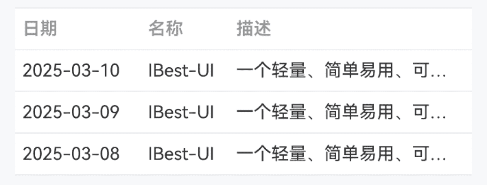
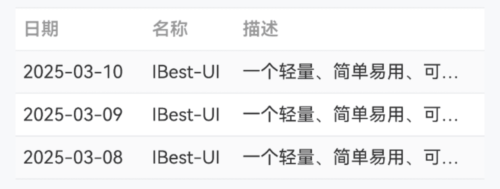
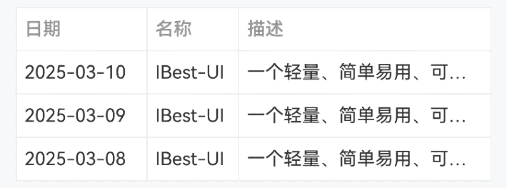
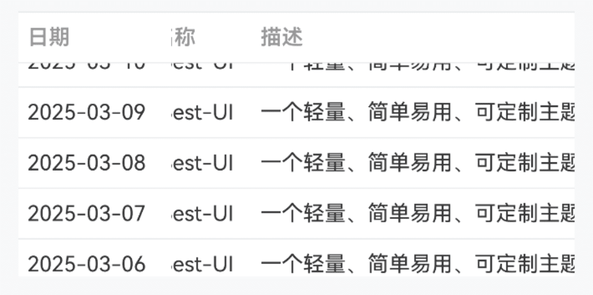
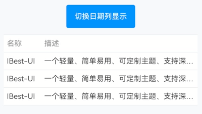
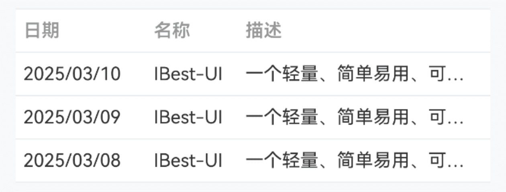
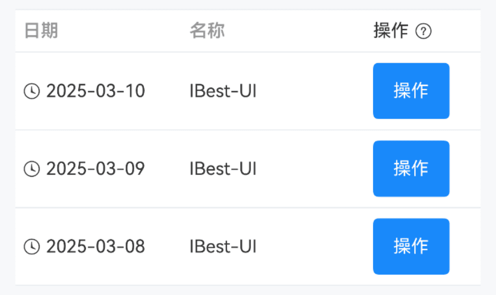
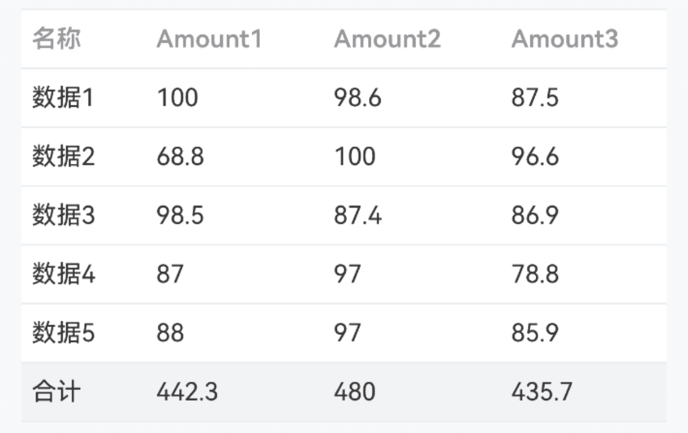

# Table 表格

## 介绍

用于展示多条结构类似的数据。
 
## 引入

```ts
import { IBestTable, IBestTableColumn, IBestTableColumnData } from "@ibestservices/ibest-ui-v2";
```

## 代码演示

### 基础用法


:::tip
`tableId` 为必传字段, 需保证全局唯一性。
:::

::: details 点我查看代码
```ts
interface TableData{
  date: string
  name: string
  desc: string
}
@Entry
@ComponentV2
struct DemoPage {
  @Local tableId: string = "table"
  @Local data: TableData[] = [
    { date: '2025-03-10', name: 'IBest-UI', desc: '一个轻量、简单易用、可定制主题、支持深色模式和浅色模式的鸿蒙开源UI组件库。' },
    { date: '2025-03-09', name: 'IBest-UI', desc: '一个轻量、简单易用、可定制主题、支持深色模式和浅色模式的鸿蒙开源UI组件库。' },
    { date: '2025-03-08', name: 'IBest-UI', desc: '一个轻量、简单易用、可定制主题、支持深色模式和浅色模式的鸿蒙开源UI组件库。' }
  ]
  build() {
    Column(){
      IBestTable({ tableId: this.tableId, data: this.data }){
        IBestTableColumn({ tableId: this.tableId, title: "日期", prop: "date", cellWidth: 100 })
        IBestTableColumn({ tableId: this.tableId, title: "名称", prop: "name", cellWidth: 70 })
        IBestTableColumn({ tableId: this.tableId, title: "描述", prop: "desc" })
      }
    }
  }
}
```
:::

### 斑马纹



::: details 点我查看代码
```ts
interface TableData{
  date: string
  name: string
  desc: string
}
@Entry
@ComponentV2
struct DemoPage {
  @Local tableId: string = "table"
  @Local data: TableData[] = [
    { date: '2025-03-10', name: 'IBest-UI', desc: '一个轻量、简单易用、可定制主题、支持深色模式和浅色模式的鸿蒙开源UI组件库。' },
    { date: '2025-03-09', name: 'IBest-UI', desc: '一个轻量、简单易用、可定制主题、支持深色模式和浅色模式的鸿蒙开源UI组件库。' },
    { date: '2025-03-08', name: 'IBest-UI', desc: '一个轻量、简单易用、可定制主题、支持深色模式和浅色模式的鸿蒙开源UI组件库。' }
  ]
  build() {
    Column(){
      IBestTable({ tableId: this.tableId, data: this.data, stripe: true }){
        IBestTableColumn({ tableId: this.tableId, title: "日期", prop: "date", cellWidth: 100 })
        IBestTableColumn({ tableId: this.tableId, title: "名称", prop: "name", cellWidth: 70 })
        IBestTableColumn({ tableId: this.tableId, title: "描述", prop: "desc" })
      }
    }
  }
}
```
:::

### 边框



::: details 点我查看代码
```ts
interface TableData{
  date: string
  name: string
  desc: string
}
@Entry
@ComponentV2
struct DemoPage {
  @Local tableId: string = "table"
  @Local data: TableData[] = [
    { date: '2025-03-10', name: 'IBest-UI', desc: '一个轻量、简单易用、可定制主题、支持深色模式和浅色模式的鸿蒙开源UI组件库。' },
    { date: '2025-03-09', name: 'IBest-UI', desc: '一个轻量、简单易用、可定制主题、支持深色模式和浅色模式的鸿蒙开源UI组件库。' },
    { date: '2025-03-08', name: 'IBest-UI', desc: '一个轻量、简单易用、可定制主题、支持深色模式和浅色模式的鸿蒙开源UI组件库。' }
  ]
  build() {
    Column(){
      IBestTable({ tableId: this.tableId, data: this.data, showBorder: true }){
        IBestTableColumn({ tableId: this.tableId, title: "日期", prop: "date", cellWidth: 100 })
        IBestTableColumn({ tableId: this.tableId, title: "名称", prop: "name", cellWidth: 70 })
        IBestTableColumn({ tableId: this.tableId, title: "描述", prop: "desc" })
      }
    }
  }
}
```
:::

### 固定列和表头



::: details 点我查看代码
```ts
interface TableData{
  date: string
  name: string
  desc: string
}
@Entry
@ComponentV2
struct DemoPage {
  @Local tableId: string = "table"
  @Local data: TableData[] = [
    { date: '2025-03-10', name: 'IBest-UI', desc: '一个轻量、简单易用、可定制主题、支持深色模式和浅色模式的鸿蒙开源UI组件库。' },
    { date: '2025-03-09', name: 'IBest-UI', desc: '一个轻量、简单易用、可定制主题、支持深色模式和浅色模式的鸿蒙开源UI组件库。' },
    { date: '2025-03-08', name: 'IBest-UI', desc: '一个轻量、简单易用、可定制主题、支持深色模式和浅色模式的鸿蒙开源UI组件库。' }
  ]
  build() {
    Column(){
      IBestTable({ tableId: this.tableId, data: this.data1, fixHeight: 140 }){
        IBestTableColumn({ tableId: this.tableId, title: "日期", prop: "date", fixed: true, cellWidth: 100 })
        IBestTableColumn({ tableId: this.tableId, title: "名称", prop: "name", cellWidth: 70 })
        IBestTableColumn({ tableId: this.tableId, title: "描述", prop: "desc", cellWidth: 500 })
      }
    }
  }
}
```
:::

### 动态显示列



::: details 点我查看代码
```ts
import { IBestButton } from '@ibestservices/ibest-ui';

interface TableData{
  date: string
  name: string
  desc: string
}
@Entry
@ComponentV2
struct DemoPage {
  @Local tableId: string = "table"
  @Local showDate: boolean = true
  @Local data: TableData[] = [
    { date: '2025-03-10', name: 'IBest-UI', desc: '一个轻量、简单易用、可定制主题、支持深色模式和浅色模式的鸿蒙开源UI组件库。' },
    { date: '2025-03-09', name: 'IBest-UI', desc: '一个轻量、简单易用、可定制主题、支持深色模式和浅色模式的鸿蒙开源UI组件库。' },
    { date: '2025-03-08', name: 'IBest-UI', desc: '一个轻量、简单易用、可定制主题、支持深色模式和浅色模式的鸿蒙开源UI组件库。' }
  ]
  build() {
    Column({space: 20}){
      IBestButton({
        type: "primary",
        text: "切换日期列显示",
        onBtnClick: () => {
          this.showDate = !this.showDate
        }
      })
      IBestTable({ tableId: this.tableId, data: this.data }){
        IBestTableColumn({ tableId: this.tableId, title: "日期", prop: "date", cellWidth: 100, show: this.showDate })
        IBestTableColumn({ tableId: this.tableId, title: "名称", prop: "name", cellWidth: 70 })
        IBestTableColumn({ tableId: this.tableId, title: "描述", prop: "desc" })
      }
    }
  }
}
```
:::

### 格式化单元格内容



::: details 点我查看代码
```ts
interface TableData{
  date: string
  name: string
  desc: string
}
@Entry
@ComponentV2
struct DemoPage {
  @Local tableId: string = "table"
  @Local data: TableData[] = [
    { date: '2025-03-10', name: 'IBest-UI', desc: '一个轻量、简单易用、可定制主题、支持深色模式和浅色模式的鸿蒙开源UI组件库。' },
    { date: '2025-03-09', name: 'IBest-UI', desc: '一个轻量、简单易用、可定制主题、支持深色模式和浅色模式的鸿蒙开源UI组件库。' },
    { date: '2025-03-08', name: 'IBest-UI', desc: '一个轻量、简单易用、可定制主题、支持深色模式和浅色模式的鸿蒙开源UI组件库。' }
  ]
  formatDate(row: TableData, column: IBestTableColumnData, rowIndex: number, columnIndex: number){
    console.log("formatDate", JSON.stringify(row), JSON.stringify(column), rowIndex, columnIndex)
    return row.date.replaceAll('-', '/')
  }
  build() {
    Column(){
      IBestTable({ tableId: this.tableId, data: this.data }){
        IBestTableColumn({
          tableId: this.tableId,
          title: "日期",
          prop: "date",
          cellWidth: 100,
          formatter: (row: TableData, column, rowIndex, columnIndex): string => this.formatDate(row, column, rowIndex, columnIndex)
        })
        IBestTableColumn({ tableId: this.tableId, title: "名称", prop: "name", cellWidth: 70 })
        IBestTableColumn({ tableId: this.tableId, title: "描述", prop: "desc" })
      }
    }
  }
}
```
:::

### 自定义单元格内容



::: details 点我查看代码
```ts
import { IBestToast } from '@ibestservices/ibest-ui';

interface TableData{
  date: string
  name: string
  desc: string
}
@Entry
@ComponentV2
struct DemoPage {
  @Local tableId: string = "table"
  @Local data: TableData[] = [
    { date: '2025-03-10', name: 'IBest-UI', desc: '一个轻量、简单易用、可定制主题、支持深色模式和浅色模式的鸿蒙开源UI组件库。' },
    { date: '2025-03-09', name: 'IBest-UI', desc: '一个轻量、简单易用、可定制主题、支持深色模式和浅色模式的鸿蒙开源UI组件库。' },
    { date: '2025-03-08', name: 'IBest-UI', desc: '一个轻量、简单易用、可定制主题、支持深色模式和浅色模式的鸿蒙开源UI组件库。' }
  ]
  @Builder headerBuilder(column: IBestTableColumnData, columnIndex: number){
    Row({space: 12}){
      Text(column.title).fontSize(14)
      IBestIcon({
        name: "question-o",
        iconSize: 14
      })
    }
  }
  @Builder customCell(row: TableData, column: IBestTableColumnData, rowIndex: number, columnIndex: number){
    if(column.prop == 'date'){
      Row({space: 12}){
        IBestIcon({
          name: "underway-o",
          iconSize: 14
        })
        Text(row.date).fontSize(14)
      }
    }else{
      IBestButton({
        type: "primary",
        text: "操作",
        onBtnClick: () => {
          IBestToast.show(`当前点击的行数据为${row.date} ${row.name}`)
        }
      })
    }
  }
  
  build() {
    Column(){
      IBestTable({ tableId: this.tableId, data: this.data }){
        IBestTableColumn({
          tableId: this.tableId,
          title: "日期",
          prop: "date",
          cellWidth: 130,
          cellBuilder: (row: TableData, column: IBestTableColumnData, rowIndex: number, columnIndex: number): void => this.customCell(row, column, rowIndex, columnIndex)
        })
        IBestTableColumn({ tableId: this.tableId, title: "名称", prop: "name" })
        IBestTableColumn({
          tableId: this.tableId,
          title: "操作",
          cellWidth: 90,
          headerBuilder: (column: IBestTableColumnData, columnIndex: number): void => this.headerBuilder(column, columnIndex),
          cellBuilder: (row: TableData, column: IBestTableColumnData, rowIndex: number, columnIndex: number): void => this.customCell(row, column, rowIndex, columnIndex)
        })
      }
    }
  }
}
```
:::

### 表尾合计行



::: details 点我查看代码
```ts
interface TableData{
  name: string
  amount1: number
  amount2: number
  amount3: number
  amount4: number
  amount5: number
}
@Entry
@ComponentV2
struct DemoPage {
  @Local tableId: string = "table"
  @Local data: TableData[] = [
    { name: "数据1", amount1: 100, amount2: 98.6, amount3: 87.5, amount4: 98.6, amount5: 94.2 },
    { name: "数据2", amount1: 68.8, amount2: 100, amount3: 96.6, amount4: 76.5, amount5: 77.4 },
    { name: "数据3", amount1: 98.5, amount2: 87.4, amount3: 86.9, amount4: 87.3, amount5: 76.4 },
    { name: "数据4", amount1: 87, amount2: 97, amount3: 78.8, amount4: 76.3, amount5: 98.54 },
    { name: "数据5", amount1: 88, amount2: 97, amount3: 85.9, amount4: 68.3, amount5: 76.9 }
  ]
  build() {
    Column(){
      IBestTable({ tableId: this.tableId, data: this.data, showSummary: true }){
        IBestTableColumn({ tableId: this.tableId, title: "名称", prop: "name", cellWidth: 70, fixed: true })
        IBestTableColumn({ tableId: this.tableId, title: "Amount1", prop: "amount1", cellWidth: 100 })
        IBestTableColumn({ tableId: this.tableId, title: "Amount2", prop: "amount2", cellWidth: 100 })
        IBestTableColumn({ tableId: this.tableId, title: "Amount3", prop: "amount3", cellWidth: 100 })
        IBestTableColumn({ tableId: this.tableId, title: "Amount4", prop: "amount4", cellWidth: 100 })
        IBestTableColumn({ tableId: this.tableId, title: "Amount5", prop: "amount5", cellWidth: 100 })
      }
    }
  }
}
```
:::


## API

### IBestTable @Props
| 参数           | 说明                           | 类型      | 默认值     |
| --------------| ------------------------------ | --------- | ---------- |
| tableId       | 表格id, 需保证全局唯一性         | _string_ \| _number_  | `''` | 
| data          | 表格数据                        | _any[]_  | `[]` |
| stripe        | 是否显示斑马纹                   | _boolean_ | `false` |
| stripeBgColor | 斑马纹背景色                     | _ResourceColor_  | `#fafafa` |
| showBorder    | 是否显示纵向边框                  | _boolean_ | `false` |
| fixHeight     | 表格固定高度                     | _string_ \| _number_ | `auto` |
| maxHeight     | 表格最大高度                     | _string_ \| _number_ | `auto` |
| headerBgColor | 表头背景色                       | _ResourceColor_  | `#fff` |
| headerTextColor| 表头文字颜色                    | _ResourceColor_  | `#969799` |
| headerFontSize | 表头文字大小                    | _string_ \| _number_  | `14` |
| bdColor       | 边框颜色                        | _ResourceColor_  | `#ebedf0` |
| cellBgColor   | 单元格背景色                     | _ResourceColor_  | `#fff` |
| cellTextColor | 单元格文字颜色                   | _ResourceColor_  | `#323233` |
| cellFontSize  | 单元格文字大小                   | _string_ \| _number_  | `14` |
| cellPadding   | 单元格内边距                     | _Length_ \| _BorderRadiuses_ \| _LocalizedBorderRadiuses_   | `{left: 6, right: 6, top: 8, bottom: 8}` |
| showSummary   | 是否显示合计行                   | _boolean_ | `false` |
| sumText       | 合计行文字                       | _ResourceStr_  | `合计` |
| summaryMethod | 合计行计算方法                   | _(data: any[], column: IBestTableColumnData) => (string \| number)[]_ | `-` |

### IBestTable 插槽
| 插槽名             | 说明               | 类型             |
| ------------------| ------------------| ----------------|
| defaultBuilder    | 默认内容            | _CustomBuilder_ |

 ### IBestTableColumn @Props
| 参数         | 说明                                 | 类型      | 默认值     |
| ------------| ------------------------------------ | --------- | ---------- |
| tableId     | 表格id, 与table的 `tableId` 一致       | _string_ \| _number_  | `''` | 
| title       | 列标题                                | _ResourceStr_  | `''` |
| prop        | 列属性                                | _string_  | `''` |
| cellWidth   | 列宽度                                | _string_ \| _number_  | `''` |
| minWidth    | 最小宽度                               | _string_ \| _number_  | `''` |
| show        | 列是否显示                             | _boolean_ | `true` |
| cellAlign   | 单元格文字对齐方式, 可选值 `left` 、`center` 、 `right` | _string_  | `left` |
| headerAlign | 表头文字对齐方式, 可选值 `left` 、`center` 、 `right`, 若不设置该项，则使用单元格的对齐方式 | _string_  | `''` |
| fixed       | 是否固定列                              | _boolean_ | `false` |
| formatter   | 格式化单元格内容方法                      | _(row: any, column: IBestTableColumnData, rowIndex: number, columnIndex: number) => string_ | `-` |

### IBestTableColumn 插槽
| 插槽名            | 说明            | 类型       |
| -----------------| ---------------| --------- | 
| headerBuilder    | 自定义表头       | `(column: IBestTableColumnData, columnIndex: number) => void` |
| cellBuilder      | 自定义单元格内容  | `(row: any, column: IBestTableColumnData, rowIndex: number, columnIndex: number) => void` |

### IBestTableColumnData 数据结构
| 参数         | 说明                 | 类型       |
| ------------| ---------------------| --------- |
| title       | 列标题                | _ResourceStr_  |
| prop        | 列属性                | _string_  |