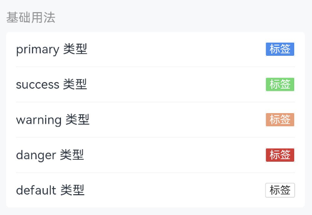

# Tag 标签

## 介绍

用于标记关键词和概括主要内容。

## 引入

```ts
import { IBestTag } from "@ibestservices/ibest-ui-v2";
```

## 代码演示

### 基础用法


::: tip
通过 `type` 属性控制标签颜色。
:::

::: details 点我查看代码
```ts
@Entry
@Component
struct DemoPage {
  build() {
    Row({space: 16}){
      IBestTag({
        text: "标签",
        type: "primary"
      })
      IBestTag({
        text: "标签",
        type: "success"
      })
      IBestTag({
        text: "标签",
        type: "warning"
      })
      IBestTag({
        text: "标签",
        type: "danger"
      })
      IBestTag({
        text: "标签",
        type: "default"
      })
    }
  }
}
```
:::

### 样式风格


::: tip
- 设置 `plain` 属性设置为空心样式。
- 通过 `round` 设置为圆角样式。
- 通过 `mark` 设置为标记样式(半圆角)。
- 添加 `closeable` 属性表示标签是可关闭的，关闭标签时会触发 `close` 事件，在 `close` 事件中可以执行隐藏标签的逻辑。
:::

::: details 点我查看代码
```ts
@Entry
@Components
struct TagPage {
  @State showTag: boolean = true
  build(){
    Row({space: 14}){
      IBestTag({
        text: '标签',
        type: 'primary',
        plain: true
      })
      IBestTag({
        text: '标签',
        type: 'primary',
        round: true
      })
      IBestTag({
        text: '标签',
        type: 'primary',
        mark: true
      })
      IBestTag({
        text: '标签',
        type: 'primary',
        closeable: true,
        show: this.showTag,
        onClose: () => {
          this.showTag = false
        }
      })
    }
  }
}
```
:::

### 自定义大小


::: tip
通过 `tagSize` 属性调整标签大小。
:::

::: details 点我查看代码
```ts
@Entry
@Component
struct DemoPage {
  build() {
    Row({space: 16}){
      IBestTag({
        type: "primary",
        text: "标签"
      });
      IBestTag({
        type: "primary",
        text: "标签",
        tagSize: "medium"
      });
      IBestTag({
        type: "primary",
        text: "标签",
        tagSize: "large"
      })
    }
  }
}
```
:::

### 自定义颜色


::: tip
通过 `color` 和 `textColor` 属性设置标签颜色。
:::

::: details 点我查看代码
```ts
@Entry
@Component
struct DemoPage {
  build() {
    Row({space: 16}){
      IBestTag({
        text: "标签",
        type: "primary",
        color: "#7232dd"
      });
      IBestTag({
        text: "标签",
        color: "#ffe1e1",
        textColor: "#ad0000"
      });
      IBestTag({
        text: "标签",
        color: "#7232dd",
        plain: true
      })
    }
  }
}
```
:::

## API

### @Props

| 参数      | 说明                                                  | 类型      | 默认值    |
| --------- | ----------------------------------------------------- | --------- | --------- |
| type      | 类型，可选值为 `primary` `success` `warning` `danger` | _string_  | `default` |
| tagSize   | 尺寸，可选值为 `large` `medium` `small`               | _string_  | `normal`  |
| text      | 标签内容                                             | _ResourceStr_  |           |
| color     | 标签颜色                                             | _ResourceColor_  |     |
| textColor | 文本颜色，优先级高于 `color`                           | _ResourceColor_  |     |
| show      | 是否展示标签                                          | _boolean_ | `true`    |
| plain     | 是否为空心样式                                        | _boolean_ | `false`   |
| mark      | 是否为标记样式                                        | _boolean_ | `false`   |
| round     | 是否为圆角样式                                        | _boolean_ | `false`   |
| closeable | 是否为可关闭标签                                      | _boolean_ | `false`   |

### Events

| 事件名     | 说明                   | 事件类型                        |
| ---------- | ----------------------| ------------------------------- |
| onClickTag | 点击标签的事件          | (event: _ClickEvent_) => _void_ |
| onClose    | 点击标签关闭按钮的事件   | (event: _ClickEvent_) => _void_ |