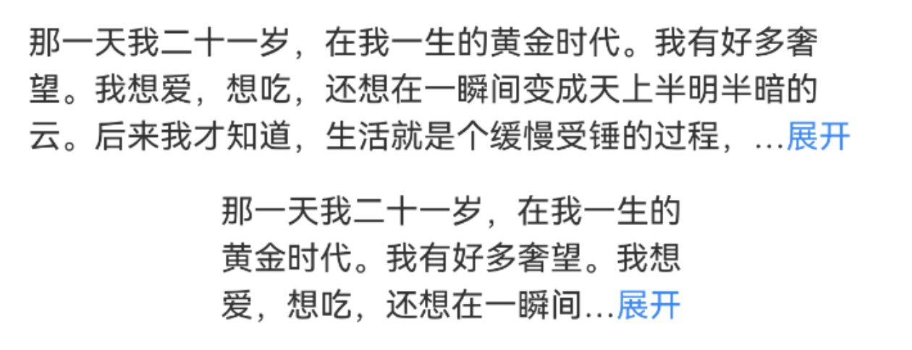
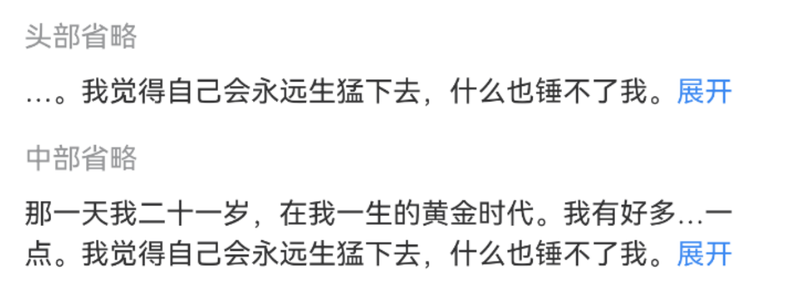

# TextEllipsis 文本省略

## 介绍

对长文本进行省略，支持展开/收起。

## 引入

```ts
import { IBestTextEllipsis } from "@ibestservices/ibest-ui-v2";
```

## 代码演示

### 基础用法


::: details 点我查看代码
```ts
@Entry
@ComponentV2
struct DemoPage {
  @Local text: string = '人一生的大部分时间都是平淡无奇的。这也是我们身体养精蓄锐的必要条件。因为只有身心在泛起涟漪的生活中得到充分的修正，才能圆满的迎接人生的下一次高峰。'
  build() {
    Column(){
      IBestTextEllipsis({
        text: this.text
      })
    }
  }
}
```
:::

### 展开/收起


::: details 点我查看代码
```ts
@Entry
@ComponentV2
struct DemoPage {
  @Local text: string = '人一生的大部分时间都是平淡无奇的。这也是我们身体养精蓄锐的必要条件。因为只有身心在泛起涟漪的生活中得到充分的修正，才能圆满的迎接人生的下一次高峰。'
  build() {
    Column(){
      IBestTextEllipsis({
        text: this.text,
        showAction: true
      })
    }
  }
}
```
:::

### 自定义展示行数



::: details 点我查看代码
```ts
@Entry
@ComponentV2
struct DemoPage {
  @Local text: string = "那一天我二十一岁，在我一生的黄金时代。我有好多奢望。我想爱，想吃，还想在一瞬间变成天上半明半暗的云。后来我才知道，生活就是个缓慢受锤的过程，人一天天老下去，奢望也一天天消失，最后变得像挨了锤的牛一样。可是我过二十一岁生日时没有预见到这一点。我觉得自己会永远生猛下去，什么也锤不了我。"
  build() {
    Column({space: 16}){
      IBestTextEllipsis({
        text: this.text,
        showAction: true,
        rows: 3
      })
      Row(){
        IBestTextEllipsis({
          text: this.text,
          showAction: true,
          rows: 3
        })
      }.width(200)
    }
  }
}
```
:::

### 自定义省略位置



::: details 点我查看代码
```ts
@Entry
@ComponentV2
struct DemoPage {
  @Local text: string = "那一天我二十一岁，在我一生的黄金时代。我有好多奢望。我想爱，想吃，还想在一瞬间变成天上半明半暗的云。后来我才知道，生活就是个缓慢受锤的过程，人一天天老下去，奢望也一天天消失，最后变得像挨了锤的牛一样。可是我过二十一岁生日时没有预见到这一点。我觉得自己会永远生猛下去，什么也锤不了我。"
  build() {
    Column({space: 16}){
      IBestTextEllipsis({
        text: this.text,
        showAction: true,
        omitPosition: 'start'
      })
      IBestTextEllipsis({
        text: this.text,
        showAction: true,
        omitPosition: 'middle',
        rows: 2
      })
    }
  }
}
```
:::

### 自定义省略内容


::: details 点我查看代码
```ts
@Entry
@ComponentV2
struct DemoPage {
  @Local text: string = '人一生的大部分时间都是平淡无奇的。这也是我们身体养精蓄锐的必要条件。因为只有身心在泛起涟漪的生活中得到充分的修正，才能圆满的迎接人生的下一次高峰。'
  build() {
    Column(){
      IBestTextEllipsis({
        text: this.text,
        omitContent: "•••"
      })
    }
  }
}
```
:::

### 自定义操作样式


::: details 点我查看代码
```ts
@Entry
@ComponentV2
struct DemoPage {
  @Local text: string = '人一生的大部分时间都是平淡无奇的。这也是我们身体养精蓄锐的必要条件。因为只有身心在泛起涟漪的生活中得到充分的修正，才能圆满的迎接人生的下一次高峰。'
  build() {
    Column(){
      IBestTextEllipsis({
        text: this.text,
        showAction: true,
        expandText: "平铺",
        collapseText: "折叠",
        actionColor: "#DB3131"
      })
    }
  }
}
```
:::

## API

### @Props

| 参数          | 说明                                | 类型       | 默认值     |
| ------------ | ----------------------------------- | --------- | ---------- |
| text         | 显示文本                              | _ResourceStr_ | `''` |  
| textColor    | 文本颜色                              | _ResourceColor_ | `#323233` |
| textFontSize | 文字大小                              | _string_ \| _number_ | `16` |
| lineHeight   | 行高                                  | _string_ \| _number_  | `20` |
| rows         | 展示的行数                             | _number_ | `1` |
| showAction   | 是否显示操作                           | _boolean_ |  `false`  |
| expandText   | 展开操作文案                           | _ResourceStr_ | `展开` |
| collapseText | 收起操作文案                           | _ResourceStr_ | `收起` |
| omitContent  | 省略号内容                             | _ResourceStr_ |  `…`  |
| actionColor  | 操作文字颜色                           | _ResourceColor_ |  `#3D8AF2`  |
| omitPosition | 省略位置，可选值 `start` `middle` `end` | _string_ |  `end`  |
| textFontWeight| 文字字重                              | _string_ \| _number_ \| _FontWeight_ |  `Normal`  |
| actionFontWeight| 操作文字字重                         | _string_ \| _number_ \| _FontWeight_ |  `Normal`  |

### Events

| 事件名         | 说明                                            | 事件类型                         |
| --------------| ------------------------------------------------| -------------------------------- |
| onActionClick | 点击操作文字时触发, isExpand 为点击后状态, true 为展开, false 为折叠 | `(isExpand: boolean) => void` |