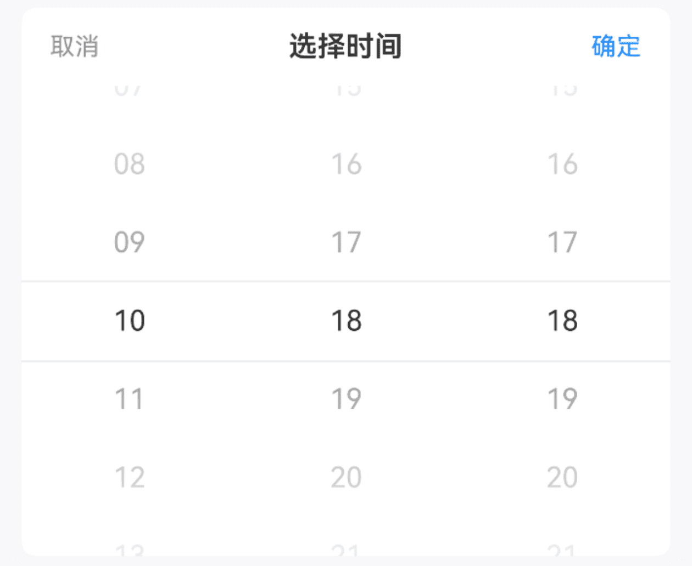
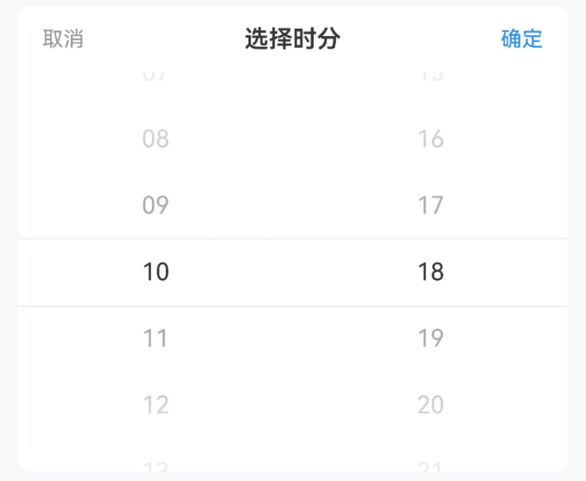
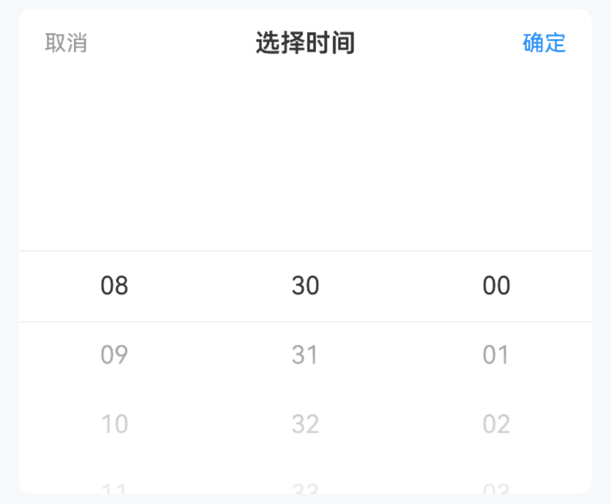
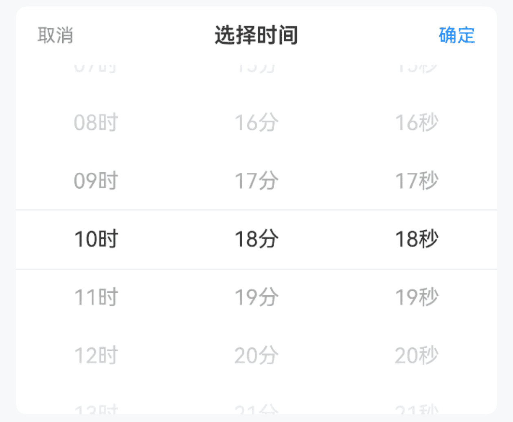
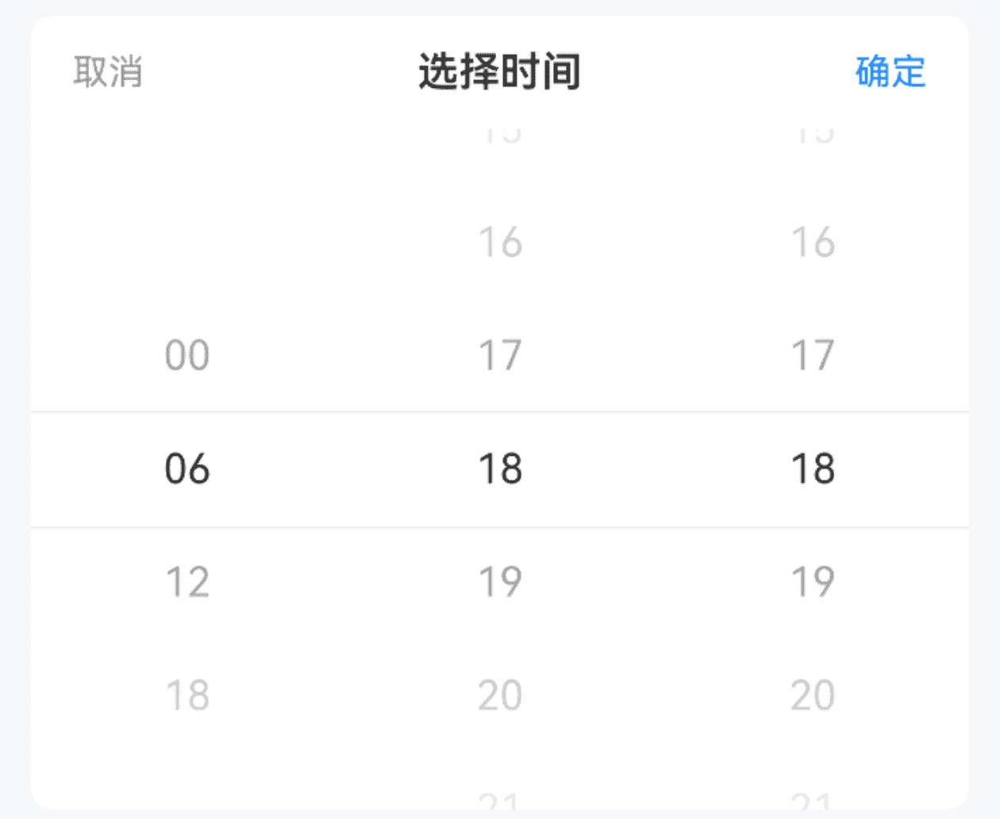

# TimePicker 时间选择

## 介绍

日期选择器，用于选择年、月、日，通常与弹出层组件配合使用。
 
## 引入

```ts
import { IBestTimePicker, IBestPickerOption } from "@ibestservices/ibest-ui-v2";
```

## 代码演示

### 基础用法



::: details 点我查看代码
```ts
@Entry
@ComponentV2
struct DemoPage {
  @Local selectValue: string[] = ["10", "18", "18"]
  build() {
    Column(){
      IBestTimePicker({
        title: "选择时间",
        value: this.selectValue!!,
        onConfirm: (value: string[]) => {
          IBestToast.show(value.join(":"))
        },
        onChange: (value: string[]) => {
          IBestToast.show(value.join(":"))
        }
      })
    }
  }
}
```
:::

### 选项类型



::: details 点我查看代码
```ts
@Entry
@ComponentV2
struct DemoPage {
  @Local selectValue: string[] = ["10", "18"]
  build() {
    Column(){
      IBestTimePicker({
        title: "选择时分",
        listType: ["hour", "minute"],
        value: this.selectValue!!,
        onConfirm: (value: string[]) => {
          IBestToast.show(value.join(":"))
        },
        onChange: (value: string[]) => {
          IBestToast.show(value.join(":"))
        }
      })
    }
  }
}
```
:::

### 时间范围


:::tip
通过 `minTime` `maxTime` 属性可控制时间范围, 格式参考 `00:00:00`。   
• 默认最小时间 `00:00:00`；   
• 默认最大时间 `23:59:59`。
:::

::: details 点我查看代码
```ts
@Entry
@ComponentV2
struct DemoPage {
  @Local selectValue: string[] = []
  build() {
    Column(){
      IBestTimePicker({
        title: "选择时间",
        minTime: "08:30:00",
        maxTime: "18:00:00",
        value: this.selectValue!!,
        onConfirm: (value: string[]) => {
          IBestToast.show(value.join(":"))
        },
        onChange: (value: string[]) => {
          IBestToast.show(value.join(":"))
        }
      })
    }
  }
}
```
:::

### 显示单位



::: details 点我查看代码
```ts
@Entry
@ComponentV2
struct DemoPage {
  @Local selectValue: string[] = []
  build() {
    Column(){
      IBestTimePicker({
        title: "选择时间",
        showUnit: true,
        value: this.selectValue!!,
        onConfirm: (value: string[]) => {
          IBestToast.show(value.join(":"))
        },
        onChange: (value: string[]) => {
          IBestToast.show(value.join(":"))
        }
      })
    }
  }
}
```
:::

### 过滤选项



::: details 点我查看代码
```ts
@Entry
@ComponentV2
struct DemoPage {
  @Local selectValue: string[] = ["2024", "08"]
  filter(type: string, options: IBestPickerOption[]): IBestPickerOption[]{
    if (type === 'hour') {
        return options.filter((option) => Number(option.value) % 6 === 0)
    }
    return options
  }
  build() {
    Column(){
      IBestTimePicker({
        title: "选择日期",
        filter: this.filter,
        value: this.selectValue!!,
        onConfirm: (value: string[]) => {
          IBestToast.show(value.join(":"))
        },
        onChange: (value: string[]) => {
          IBestToast.show(value.join(":"))
        }
      })
    }
  }
}
```
:::

## API

### @Props

| 参数         | 说明                                          | 类型      | 默认值     |
| ------------ | ---------------------------------------------| --------- | ---------- |
| value        | 当前选中的日期, 支持双向绑定                      | _string[]_  | `[]` | 
| minTime      | 最小可选时间                                   | _string_  | `00:00:00`  |
| maxTime      | 最大可选时间                                   | _string_ | `23:59:59`  |
| listType     | 列表类型                                       | _('hour' \| 'minute' \| 'second')[]_ | `["hour", "minute", "second"]`|
| showUnit     | 是否显示单位                                   | _boolean_ | `false` |
| title        |  标题                                         | _ResourceStr_ |  `''`  |
| itemHeight   | 单项高度                                       | _number_ \| _string_ | `44`   |
| visibleItemCount | 可见选项数量                                | _number_ | `6`   |
| showToolBar   | 是否显示顶部栏                                 | _boolean_ | `true` |
| confirmText   | 确认按钮文字                                   | _ResourceStr_ |  `确定`  |
| cancelText    | 取消按钮文字                                   | _ResourceStr_ |  `取消`  |
| filter        | 过滤器                                         | _(type: string, options: IBestPickerOption[]) => IBestPickerOption[]_ | `null` |
| groupId       | 分组id, 通常在配合PickerGroup组件使用时传入      | _string_ \| _number_ | `''` |
| horizontal    | 是否横向                                       | _boolean_ | `false` |
| itemWidth     | 单项宽度                                       | _number_ \| _string_ | `44`   |
| contentHeight | 整体高度, 仅横向时生效                           | _number_ \| _string_ | `44`   |
| optionFontSize| 选项字体大小                                    | _number_ \| _string_ | `16`   |
| radius <span style="font-size: 12px; padding:2px 4px;color:#3D8AF2;border-radius:4px;border: 1px solid #3D8AF2">1.0.0</span>| 外部圆角                                       | _number_ \| _string_ | `0`   |
 
### Events

| 事件名     | 说明         | 回调参数             |
| ----------| ------------------------------ | -------------------------------- |
| onChange | 某一列选项变更后触发 | `value: string[]` |
| onConfirm | 点击确定按钮时触发 | `value: string[]` |
| onCancel |  点击取消按钮时触发 | `-` |