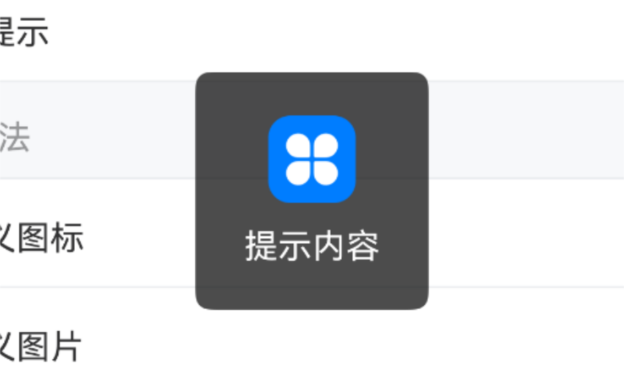

# Toast 轻提示

## 介绍

在页面中间弹出黑色半透明提示，用于消息通知、加载提示、操作结果提示等场景。
 
## 引入

```ts
import { IBestToast } from "@ibestservices/ibest-ui-v2";

```
## 代码演示

### 文字提示


::: details 点我查看代码

```ts
@Entry
@ComponentV2
struct DemoPage {
  build() {
    Column(){
      IBestButton({
        text: '基础用法',
        onBtnClick: () => {
          IBestToast.show("提示内容")
        }
      })
    }
  }
}
```
:::

### 成功提示


::: details 点我查看代码
```ts
@Entry
@ComponentV2
struct DemoPage {
  build() {
    Column(){
      IBestButton({
        text: '成功提示',
        onBtnClick: () => {
          IBestToast.show({
            type: "success",
            message: "提示内容"
          })
        }
      })
    }
  }
}
```
:::

### 警告提示


::: details 点我查看代码
```ts
@Entry
@ComponentV2
struct DemoPage {
  build() {
    Column(){
      IBestButton({
        text: '警告提示',
        onBtnClick: () => {
          IBestToast.show({
            type: "warning",
            message: "提示内容"
          })
        }
      })
    }
  }
}
```
:::

### 失败提示


::: details 点我查看代码
```ts
@Entry
@ComponentV2
struct DemoPage {
  build() {
    Column(){
      IBestButton({
        text: '失败提示',
        onBtnClick: () => {
          IBestToast.show({
            type: "fail",
            message: "提示内容"
          })
        }
      })
    }
  }
}
```
:::

### 加载提示


::: details 点我查看代码
```ts
@Entry
@ComponentV2
struct DemoPage {
  build() {
    Column(){
      IBestButton({
        text: '加载提示',
        onBtnClick: () => {
          IBestToast.showLoading()
          setTimeout(() => {
            IBestToast.hide()
          }, 1500)
        }
      })
    }
  }
}
```
:::

### 自定义图标



::: details 点我查看代码
```ts
@Entry
@ComponentV2
struct DemoPage {
  build() {
    Column(){
      IBestButton({
        text: '自定义图标',
        onBtnClick: () => {
          IBestToast.show({
            icon: $r("app.media.startIcon"),
            message: "提示内容"
          })
        }
      })
    }
  }
}
```
:::

### 自定义图片


::: details 点我查看代码
```ts
@Entry
@ComponentV2
struct DemoPage {
  build() {
    Column(){
      IBestButton({
        text: '自定义图片',
        onBtnClick: () => {
          IBestToast.show({
            icon: "https://ibestui.ibestservices.com/favicon.ico",
            message: "提示内容"
          })
        }
      })
    }
  }
}
```
:::

### 自定义加载图标类型


::: details 点我查看代码
```ts
@Entry
@ComponentV2
struct DemoPage {
  build() {
    Column(){
      IBestButton({
        text: '自定义加载图标类型',
        onBtnClick: () => {
          IBestToast.show({
            type: "loading",
            loadingType: "spinner",
            message: "加载中...",
            onOpened: () => {
              // 可在此关闭loading
              console.log("toast打开成功")
            }
          })
          setTimeout(() => {
            // 也可在此关闭loading
            IBestToast.hide()
          }, 2000)
        }
      })
    }
  }
}
```
:::

### 自定义位置


::: tip
通过 `position` 属性可以自定义位置， 通过 `offsetY` 可设置偏移量。
:::

::: details 点我查看代码
```ts
@Entry
@ComponentV2
struct DemoPage {
  build() {
    Column(){
      IBestButton({
        text: '自定义位置',
        onBtnClick: () => {
          IBestToast.show({
            position: "top",
            offsetY: "20%",
            message: "提示内容"
          })
        }
      })
    }
  }
}
```
:::

### 文字换行方式


::: tip
通过 `wordBreak` 属性可以设置文字换行方式。
:::

::: details 点我查看代码
```ts
@Entry
@ComponentV2
struct DemoPage {
  build() {
    Column(){
      IBestButton({
        text: '文字换行方式',
        onBtnClick: () => {
          IBestToast.show({
            wordBreak: "break-all",
            message: "This message will contain a incomprehensibilities long word."
          })
        }
      })
    }
  }
}
```
:::

### 动态更新提示


::: details 点我查看代码
```ts
@Entry
@ComponentV2
struct DemoPage {
  build() {
    Column(){
      IBestButton({
        text: '动态更新提示',
        onBtnClick: () => {
          let count = 3
          let toast = IBestToast.show({
            type: "loading",
            message: `倒计时 ${count} 秒`,
            duration: 0
          })
          let timer = setInterval(() => {
            count--
            if (count) {
              toast.message = `倒计时 ${count} 秒`
            } else {
              clearInterval(timer)
              IBestToast.hide()
            }
          }, 1000)
        }
      })
    }
  }
}
```
:::

## API

### 方法

| 方法名      | 说明                      | 参数                       |  返回值          |
| ---------- | -------------------------|--------------------------- |------------------|
| show       |  展示提示                  | _string_ \| _ToastParams_  | toast 实例        |
| hide       |  隐藏提示                  | -                          | -                |
| showLoading|  展示loading              |  _LoadingOption_ |  -  |

### LoadingOption 数据结构
| 参数         | 说明                                                     | 类型      | 默认值     |
| ------------ | --------------------------------------------------------| --------- | ---------|
| message      | 展示文本内容                                              | _ResourceStr_  | "" |
| duration     | 展示时长(ms)，值为 0 或 type为 `loading` 时toast 不会自动消失 | _number_   | 1500  |
| loadingType  | 加载图标类型，可选值为 `circular`、`spinner`，type为 `loading` 时有效 | _boolean_   | `circular` |

### ToastParams 数据结构, 继承至LoadingOption

| 参数         | 说明                                                     | 类型      | 默认值     |
| ------------ | --------------------------------------------------------| --------- | ---------- |
| type         | 展示类型，可选值为 `success`、`warning`、`fail`、`loading`  | _string_  | "" |
| wordBreak    | 文本换行方式，可选值为 `normal`、`break-all` 、`break-word` | _string_   | `normal` |
| icon         | 自定义图标，支持网络图片和本地图片，优先级大于type              | _string_ \| _Resource_   | "" |
| isShowMask   | 是否显示遮罩                                              | _boolean_   | `false` |
| position     | 位置，可选值为 `top` 、`center`、`bottom`                  | _string_   | `center` |
| offsetY      | 偏移量                                                   | _string_ \| _number_   | `0` |
| iconWidth    | 自定义图标宽度                                             | _string_ \| _number_   | `36` |
| onOpened     | 完全展示后的回调函数                                        | _() => void_ | `-` |
| onClosed <span style="font-size: 12px; padding:2px 4px;color:#3D8AF2;border-radius:4px;border: 1px solid #3D8AF2">0.0.7</span>| 完全关闭后的回调函数  | _() => void_ | `-` |