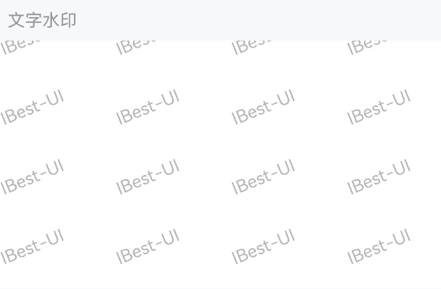
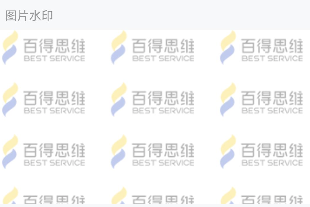
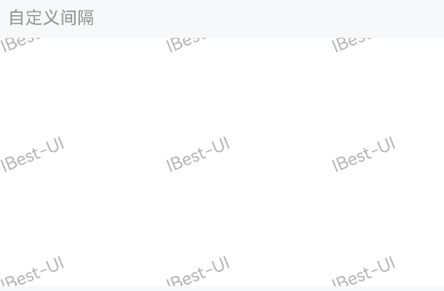
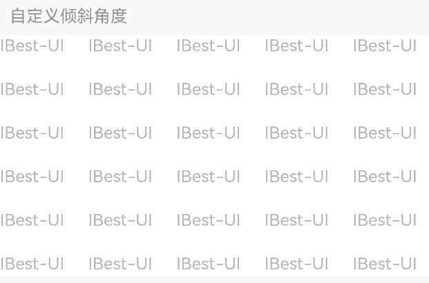

# Watermark 水印

## 介绍

在页面上添加特定的文字或图案作为水印，可用于防止信息盗用。

## 引入

```ts
import { IBestWatermark } from "@ibestservices/ibest-ui-v2";
```

### 文字水印


::: tip
通过 `text` 属性来设置水印的文字。
:::

::: details 点我查看代码
```ts
@Entry
@Component
struct DemoPage {
  build() {
    Column(){
      IBestWatermark({
        text: 'IBest-UI',
        fontSize: 14,
        gapX: 40,
        gapY: 40
      }){
        // 你的业务代码
      }
    }
  }
}
```
:::

### 图片水印


::: tip
通过 `imageUrl` 属性来设置水印的图片。
:::

::: details 点我查看代码
```ts
@Entry
@Component
struct DemoPage {
  build() {
    Column(){
      IBestWatermark({
        imageUrl: '图片链接',
        waterMarkWidth: 105,
        waterMarkHeight: 40,
        gapX: 20,
        gapY: 20,
        rotateDeg: 0
      }){
        // 你的业务代码
      }
    }
  }
}
```
:::

### 自定义间隔


::: tip
通过 `gapX` 和 `gapY` 属性来控制多个重复水印之间的间隔。
:::

::: details 点我查看代码
```ts
@Entry
@Component
struct DemoPage {
  build() {
    Column(){
      IBestWatermark({
        text: 'IBest-UI',
        fontSize: 14,
        gapX: 80,
        gapY: 80
      }){
        // 你的业务代码
      }
    }
  }
}
```
:::

### 自定义倾斜角度


::: tip
通过 `rotateDeg` 属性来控制水印的倾斜角度，默认值为 `-22`。
:::

::: details 点我查看代码
```ts
@Entry
@Component
struct DemoPage {
  build() {
    Column(){
      IBestWatermark({
        text: 'IBest-UI',
        fontSize: 14,
        gapX: 20,
        gapY: 20,
        rotateDeg: 0
      }){
        // 你的业务代码
      }
    }
  }
}
```
:::

## API

### @Props

| 参数 | 说明      | 类型     | 默认值                              |
| ---------------- | ----------- | -------- | ------ |
| waterMarkWidth   | 单个图片水印的宽度（文字水印可忽略该参数）      | _number_ | `100`      |
| waterMarkHeight  | 单个图片水印的高度（文字水印可忽略该参数）      | _number_ | `100`      |
| waterMarkOpacity | 水印的透明度 0~1                           | _number_ | `0.3`      |
| gapX             | 水印之间的水平间隔                          | _number_ | `0`        |
| gapY             | 水印之间的垂直间隔                          | _number_ | `0`        |
| rotateDeg        | 水印的旋转角度                             | _number_ | `-22`      |
| imageUrl         | 水印的图片链接                             | _string_ |  `''`   |
| text             | 文字水印的内容（文字水印优先级高于图片水印，如果同时传了`text`和`imageUrl`那么显示的将会是`text`的内容） | _ResourceStr_ | `''` |
| fontSize         | 文字水印的大小                              | _number_ | `14`      |
| fontFamily       | 文字字体                                   | _string_ | `sans-serif` |
| fontColor        | 文字颜色                                   | _string \| number \| <a href="https://developer.huawei.com/consumer/cn/doc/harmonyos-references-V5/ts-components-canvas-canvasgradient-V5" target="__blank">CanvasGradient</a> \| <a href="https://developer.huawei.com/consumer/cn/doc/harmonyos-references-V5/ts-components-canvas-canvaspattern-V5#canvaspattern" target="__blank">CanvasPattern</a>_ | <div style="padding: 2px 4px; background: #000; color: #fff; border-radius: 4px">#000000</div> |
| waterMarkZIndex  | 水印的 z-index                             | _number_ | `-1`      |
| bgColor          | 背景色                                     | _ResourceColor_ | `#fff` |

### 插槽

| 插槽名         | 说明              | 类型                      |
| -------------- | ---------------- | ------------------------- |
| defaultBuilder | 水印包裹的内容     | _CustomBuilder_ |