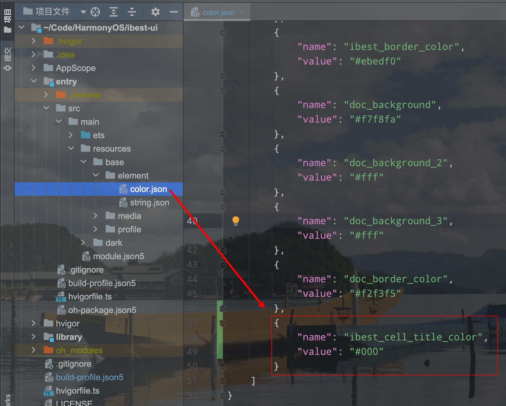
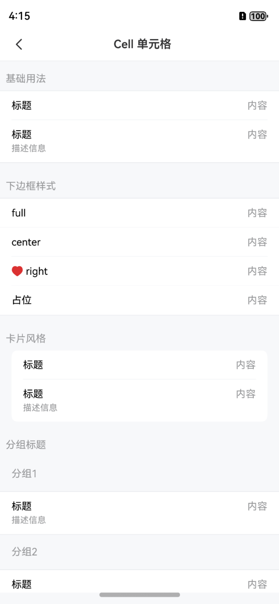
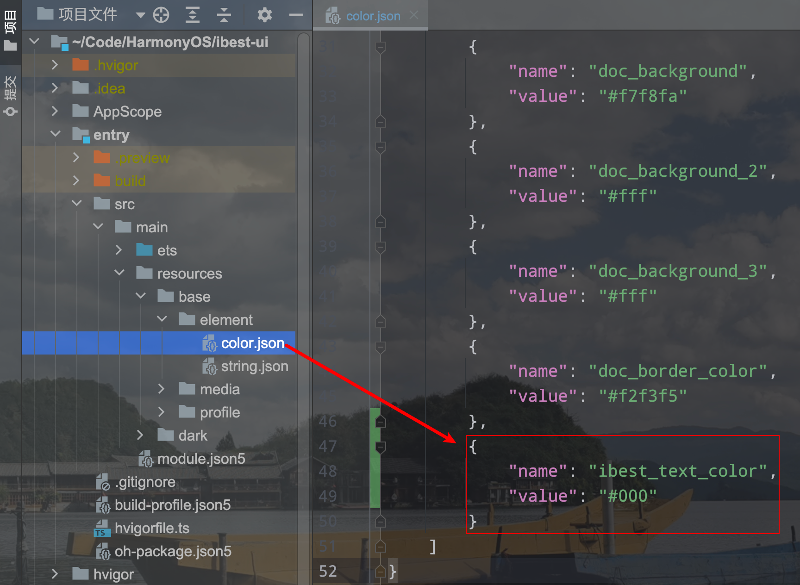

# 颜色模式

## 介绍

IBest-UI-V2 组件库完整适配浅色模式和深色模式, 开发者可自定义每个模式的主题颜色。

## 修改方式

组件库提供两种修改组件在不同颜色模式下的颜色, 以修改 `IBestCell` 组件的 `title颜色` 为例。

:::tip
• 颜色变量名称请参考组件库的样式文件, 路径为 `oh_modules/@ibestservices/ibest-ui-v2/src/main/resources` 下 `base/element/color.json` 与 `dark/element/color.json` 文件。   

• 目前仅支持了部分组件的`颜色变量`, 如有其他组件`颜色变量`的需求, 可以提 issue 或 在QQ群 `953492584` 里反馈。 
:::

### 方式1 - 组件覆盖 *推荐*

在项目下的 `entry/src/main/resources/base/element/color.json` 中重写 `ibest_cell_title_color` 变量, 即可覆盖浅色模式下的 `IBestCell` 组件的 `title颜色`, 深色同理。

:::tip
此方法仅对 `IBestCell` 组件有效，不影响其他组件, 推荐此方法。
:::

	
	

### 方式2 - 全局覆盖 (谨慎)

在项目下的 `entry/src/main/resources/base/element/color.json` 或 `AppScope/resources/base/element/color.json` 中重写 `ibest_text_color` 变量, 即可覆盖浅色模式下的 `IBestCell` 组件的 `title颜色`, 深色同理。   

:::tip
• 由于 `ibest_cell_title_color` 引用了 `ibest_text_color`, 所以此方法也可以修改 `IBestCell` 组件的 `title颜色`。   

• 但引用了 `ibest_text_color` 的变量很多, 因此此方法也会影响其他组件, 谨慎使用。
:::

	
	

