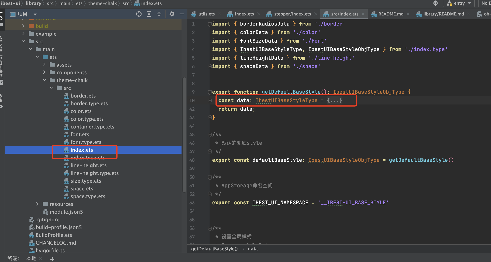
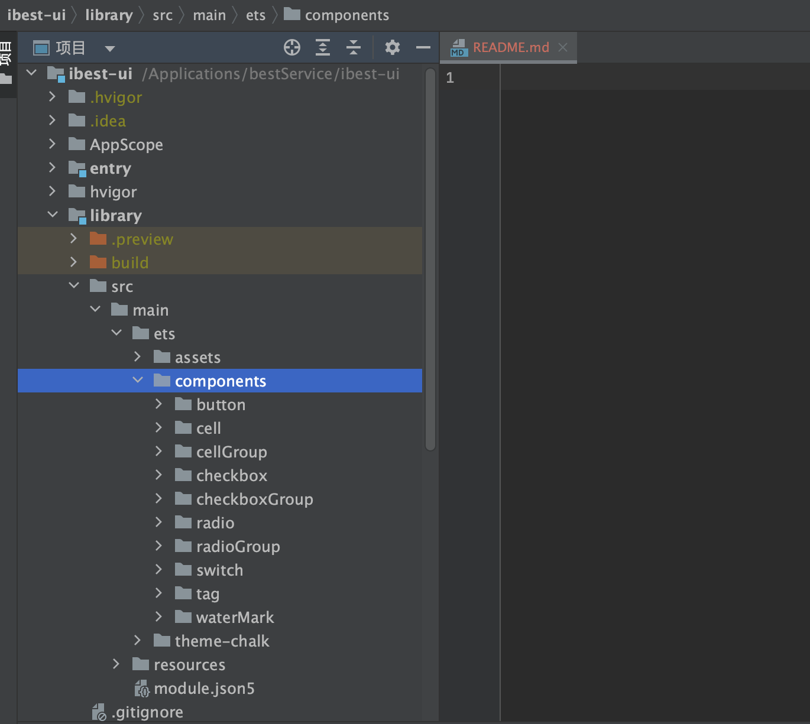

# 贡献指南

## 介绍

感谢你使用 {{ $frontmatter.title }}。

以下是关于向 {{ $frontmatter.title }} 提交反馈或代码的指南。在向 {{ $frontmatter.title }} 提交 [issue](https://github.com/ibestservices/ibest-ui-v2/issues) 或者 [PR](https://github.com/ibestservices/ibest-ui-v2/pulls) 之前，请先花几分钟时间阅读以下内容。

## Issue 规范

- 遇到问题时，请先确认这个问题是否已经在 issue 中有记录或者已被修复。
- 提 issue 时，请用简短的语言描述遇到的问题，并添加出现问题时的环境和复现步骤。

## 参与开发前准备

在进行本地开发前，请先确保你的开发环境中 `DevEco-Studio` 已升级到最新release版本，且能够正常运行，相关配置正确。
按照下面的步骤操作，即可在本地开发组件。

1. 克隆fork之后的仓库;
2. 如果不是第一次 fork, 请同步主仓库 master 分支的最新代码至当前 master 分支, 保证当前 fork 仓库 的 master 分支与主仓库的 master 分支一致;
3. 运行项目到模拟器或真机, 确保项目运行没有问题;

## 全局样式

### 开发组件时如何使用全局样式

```ts
import { IBestStorageKey } from '../../model/Global.type'
import { IBestUIBaseStyle, IBestUIBaseStyleObjType } from '../../theme-chalk/src/index.type'
import { AppStorageV2 } from '@kit.ArkUI'

@ComponentV2
export struct IBest组件名称 {
  /**
   * 全局公共样式
   */
  @Local baseStyle: IBestUIBaseStyleObjType = AppStorageV2.connect(IBestUIBaseStyle, IBestStorageKey.BASE_STYLE)!

  build(){
    Column(){

    }.animation({ duration: this.baseStyle.animationDuration as number})
  }
}
```

### 如何扩展全局样式

将样式赋值在 `library/src/theme-chalk/src/index.ts` 中对外暴露的对象即可。



## 目录结构

> [ArkTS 工程目录结构（Stage 模型)](https://developer.huawei.com/consumer/cn/doc/harmonyos-guides-V5/start-with-ets-stage-V5#arkts%E5%B7%A5%E7%A8%8B%E7%9B%AE%E5%BD%95%E7%BB%93%E6%9E%84stage%E6%A8%A1%E5%9E%8B)

::: details 查看目录结构

```shell
├── entry # 例子hap包
│   └── src
│   ├── main
│   │   ├── ets
│   │   │   ├── assets
│   │   │   │   └── styles # 例子页面样式
│   │   │   ├── components # 例子组件
│   │   │   ├── entryability
│   │   │   └── pages # 例子页面
│   │   └── resources
│   │   ├── base
# ...
├── hvigor
├── library  # 组件库
│   └── src
│   └── main
│   ├── ets
│   │   ├── assets
│   │   │   └── ets # 工具方法
│   │   ├── components # 组件目录
│   │   │   ├── button
│   │   │   ├── cell
│   │   │   └── ...
│   │   └── theme-chalk # 样式变量
│   │   └── src
│   └── resources # 组件库资源
│   ├── base
# ...

```

:::

## 代码规范

在编写代码时，请注意：

- 确保代码可以通过的 鸿蒙编辑器及仓库的 ESLint 校验。

## 提交 Pull Request

### 参考指南

如果你是第一次在 GitHub 上提 Pull Request ，可以阅读下面这两篇文章来学习：

- [第一次参与开源](https://github.com/firstcontributions/first-contributions/blob/main/translations/README.zh-cn.md)
- [如何优雅地在 GitHub 上贡献代码](https://segmentfault.com/a/1190000000736629)

### Pull Request 规范

在提交 Pull Request 时，请注意：

- 保持你的 PR 足够小，一个 PR 只解决单个问题或添加单个功能。
- 当新增组件或者修改原有组件时，记得增加或者修改对应的单元测试，保证代码的稳定。
- 在 PR 中请添加合适的描述，并关联相关的 Issue。

### Pull Request 流程

1. 基于 fork 后仓库的 master 分支新建一个分支，比如 feature/button_color;
2. 在 `library/components` 目录下开发组件、修复 BUG 或做你想做的事情
   
3. 开发完成后，提 Pull Request 到主仓库的 最新开发分支(feature/最高版本号) 或 master 分支, 如果不确定合并到哪个分支, 请在qq或微信群联系管理员, 确定合并到哪个分支;
4. Pull Request 会在 Review 通过后被合并到主仓库;
5. 等待 {{ $frontmatter.title }} 发布新版本。

### Pull Request 标题格式

Pull Request 的标题应该遵循以下格式：

```shell
type(ComponentName?)：commit message
```

示例

- docs: fix typo in quickstart
- build: optimize build speed
- fix(Button): incorrect style
- feat(Button): add color prop

可选的类型：

- fix
- feat
- docs
- perf
- test
- types
- style
- build
- chore
- release
- refactor
- breaking change
- revert:

### 同步最新代码

提 Pull Request 前，请依照下面的流程同步主仓库的最新代码：

```shell
# 添加主仓库到 remote
git remote add upstream git@github.com:ibestservices/ibest-ui-v2.git

# 拉取主仓库最新代码
git fetch upstream

# 切换至 master 分支
git checkout master

# 合并主仓库代码
git merge upstream/master
```