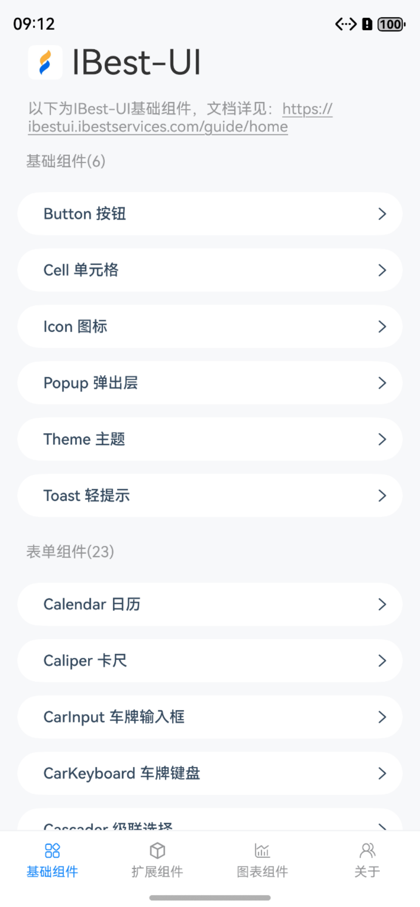
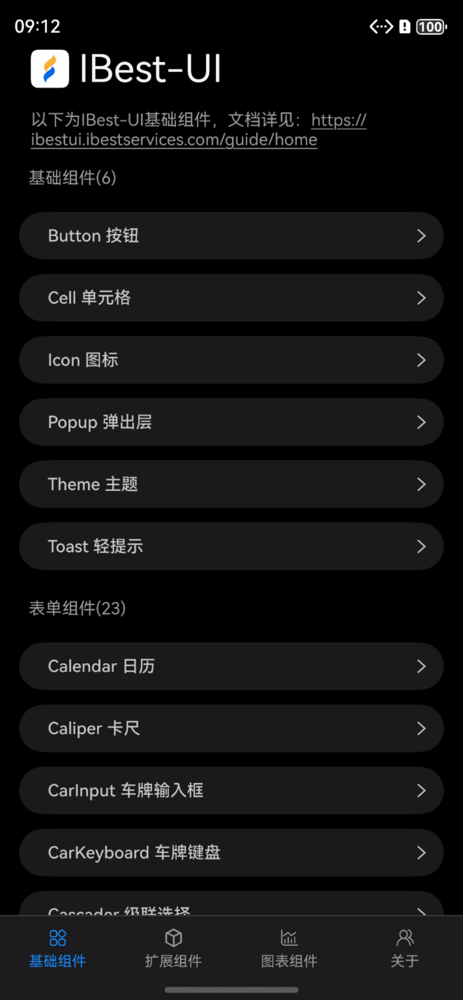
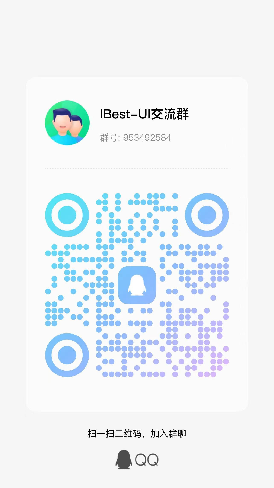

  

{{ $frontmatter.title }}

轻量、可定制的 HarmonyOS Next 组件库

    <a href="https://ohpm.openharmony.cn/#/cn/detail/@ibestservices%2Fibest-ui-v2" target="_blank">三方库中心仓</a>
    &nbsp;
    ·
    &nbsp;
    <a href="https://github.com/ibestservices/ibest-ui-v2" target="_blank">Github</a>

## 介绍

{{ $frontmatter.title }}是一个**轻量、简单易用、可定制主题、支持深色模式和浅色模式**的鸿蒙开源UI组件库, 包含Button、Calendar、Form、Field、Picker、Popup、Toast、Dialog、ImageCropper等50+个优质组件。

目前 ibestservices 官方提供了 <a href="https://ibestui.ibestservices.com/guide/home/" target="_blank">V1</a> 和 <a href="https://ibestui-v2.ibestservices.com/guide/home/" target="_blank">V2</a> 版本, 当前文档为状态管理V2版本，请根据自己项目使用的**状态管理版本**选择对应的版本使用。

  
  

## 特性
- 🚀 50+ 个高质量组件，覆盖移动端主流场景
- 💪 单元测试覆盖率超过 90%，提供稳定性保障
- 📖 提供丰富的中文文档和组件示例
- 🍭 支持主题定制，内置 100+ 个主题变量
- 🍭 支持元服务
- 🍭 支持深色模式
- 🌍 支持国际化

## 体验预览

升级到 HarmonyOS NEXT 的手机, 可在应用商店搜索 `best`、`ibest` 关键字, 下载第一个名为 `IBest-UI` 的应用, 即可体验。

## 快速上手

请阅读[快速上手](../quickstart/index)章节，通过该章节你可以了解到 {{ $frontmatter.title }} 的安装方法和基本使用姿势。

## 官方生态

| 项目        | 描述         |          |
|:-----------|:------------|:----------|
| @ibestservices/area-data | 中国省市区数据，适用于鸿蒙 arkui的 TextPicker 和 {{ $frontmatter.title }} 的 IBestCascader 等组件。 | <a href="https://ohpm.openharmony.cn/#/cn/detail/@ibestservices%2Farea-data">地址</a> |

## 其它链接
- [Gitee](https://gitee.com/ibestservices/ibest-ui-v2)
- [更新日志](https://github.com/ibestservices/ibest-ui-v2/releases)

## 官方QQ 群

群号：953492584

## 微信群

先进 QQ 群, 群里有微信群二维码

## 特别感谢

[vant](https://vant-contrib.gitee.io/vant/#/zh-CN/home)：灵感来源   
[安徽百得思维信息科技有限公司](https://www.ibestservices.com/)：孵化公司

## 贡献指南

贡献代码请阅读我们的[贡献指南](../contribution/)。   
使用过程中发现任何问题都可以提 [issue](https://github.com/ibestservices/ibest-ui-v2/issues) 给我们，当然，我们也非常欢迎你给我们发 [PR](https://github.com/ibestservices/ibest-ui-v2/pulls)。

## 贡献者

感谢以下同学对 `{{ $frontmatter.title }}` 做的贡献:   

## 开源协议

本项目基于 `Apache2.0` 协议，请自由地享受和参与开源。