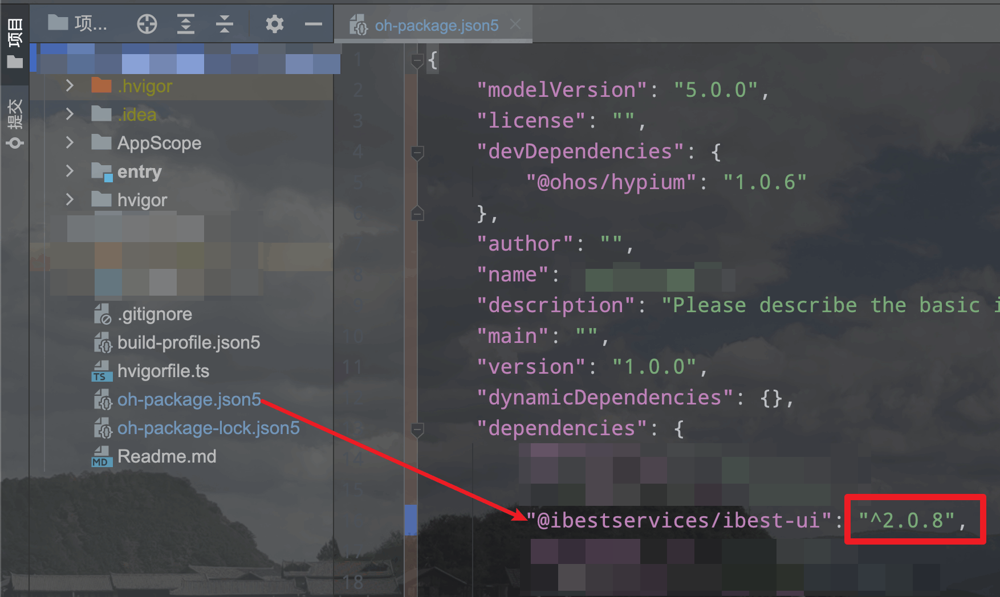

# 快速上手

## 介绍

通过本章节你可以了解到 IBest-UI-V2 的安装方法和基本使用姿势。
::: tip
• 由于api功能限制, 不支持在预览器调试。   
请在 `模拟器` 或 `真机` 上调试!   
请在 `模拟器` 或 `真机` 上调试!   
请在 `模拟器` 或 `真机` 上调试!
:::   

## 一、安装
:::tip
• 如果想固定版本, 将 `^` 去掉即可;   
• 如果想使用之前的某个版本, 请先**使用以下命令安装IBest-UI-V2**, 然后在根目录下 oh-package.json5 中, 将 dependencies 中 "@ibestservices/ibest-ui-v2" 后面的版本号修改为想要使用的版本号, 点击右上角 `Sync now` 即可;   
• 不建议使用 `ohpm install @ibestservices/ibest-ui-v2@版本号` 的方式安装对应版本。



• **组件库版本与api版本对应关系**
| 组件库版本        | sdk版本      |
|:----------------|:------------|
| v0.0.1及以上     | `api15` 以上  |
| v0.0.8及以上     | `api17` 以上  |
:::

```shell
ohpm install @ibestservices/ibest-ui-v2
```

## 二、初始化

```ts
import { IBestInit } from "@ibestservices/ibest-ui-v2"

onWindowStageCreate(windowStage: window.WindowStage): void {
  windowStage.loadContent('pages/Index', (err, data) => {
    // 在此处初始化组件库!!!
    // 在此处初始化组件库!!!
    // 在此处初始化组件库!!!
    IBestInit(windowStage, this.context)
  })
}
```

## 三、使用

```ts
import { IBestButton } from "@ibestservices/ibest-ui-v2"

@ComponentV2
export struct DemoPage {
  build(){
    Column(){
      IBestButton({
        // ...
      })
    }
  }
}
```

## 四、提示

- 在传递组件插槽时, 请使用箭头函数传递, 避免this指向问题
- 一些组件需要传递分组id, 以关联子组件, 请保证传入的id具有全局唯一性, 否则会出现一些不可预知的问题
